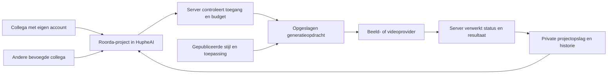

# Beeld- en videoworkflow — eerste interne versie voor Roorda

Datum: 6 oktober 2026. Status: onderzoek en voorstel; nog geen implementatiebesluit.

Dit document beschrijft de kortste verantwoorde route naar dagelijks bruikbare beeld- en videogeneratie in HupheAI. Uitgangspunt is de huidige code in `HupheShell`, aangevuld met actuele officiële documentatie van de gebruikte diensten. Alleen dit document is toegevoegd. De app, database, instellingen en externe diensten zijn niet aangepast.

Door Tom bevestigd: iedereen gebruikt een eigen account; collega’s moeten zelfstandig verder kunnen wanneer Tom afwezig is; de eerste interne versie is alleen voor Macs bij Roorda.

## 1. Advies en belangrijkste conclusie

**Maak het bestaande Atelier af als een kleine, gedeelde Roorda-werkplek voor beeld en korte video.** De benodigde interface en verschillende technische bouwstenen bestaan al. De ontbrekende basis zit vooral in duurzame opslag, projecttoegang, centraal beschikbare stijlen, betrouwbare generatieopdrachten en kosten die bij het juiste account terechtkomen.

De huidige code bewijst nog niet dat een collega op een andere Mac het volledige werk kan overnemen. Er is een wezenlijk verschil tussen een resultaat op Toms Mac zien, een bestand delen en een project inclusief bronmateriaal en instellingen kunnen voortzetten.

De eerste versie moet deze keten afmaken:

> Eigen account → Roorda-project → toepassing en stijl kiezen → beeld maken/bewerken → beeld animeren → resultaat automatisch bewaren → collega gaat verder → beeld/video downloaden.

Daarvoor zijn zes zaken doorslaggevend:

1. **Roorda-werk hoort duurzaam bij Roorda.** De maker blijft herkenbaar, maar hoeft niet online te zijn en is niet de enige beheerder.
2. **Projecten én bestanden staan centraal.** Ook referentiebeelden, eerdere varianten, video’s en gebruikte instellingen moeten op een tweede Mac beschikbaar zijn.
3. **Tom kan een stijl of toepassing publiceren.** Een wijziging in zijn lokale admininstellingen is nu nog geen gedeelde Roorda-configuratie.
4. **Eén bewezen beeldroute en één bewezen videoroute.** De huidige video-aanroep gebruikt een ander API-contract dan de huidige officiële OpenRouter-videodocumentatie.
5. **Een opdracht blijft bestaan na sluiten van de app.** Status, resultaat en kosten mogen niet uitsluitend afhangen van een lokaal scherm dat openblijft.
6. **Een collega kan installeren, inloggen en starten zonder technische inrichting.** De eerste release moet op een schone Roorda-Mac worden bewezen.

Advies voor de pilot: drie tot vijf collega’s, twee beheerders, één of twee geselecteerde beeldmodellen, één videomodel en drie concrete toepassingen. Breid pas uit nadat deze keten werkt.

## 2. Wat dit onderzoek wel en niet aantoont

**Code aanwezig** betekent dat een implementatie of aangesloten codepad is gevonden. Het betekent niet dat de actuele provider, productieconfiguratie en complete gebruikersreis zijn getest.

Onderzocht zijn de renderer, Electron-handlers, Supabase-proxies, aanwezige SQL-migraties, relevante ontwerpdocumenten en Mac-distributieconfiguratie. De bestaande security-smoketest is uitgevoerd en gaf 10/10 geslaagde broncodechecks. Dat is geen functionele beeld/video- of samenwerkingstest.

Niet uitgevoerd: betaalde generaties, productie-databaseonderzoek, controleren van echte sleutels, deployments, wijzigingen aan accounts, installatie op een tweede Mac of een volledige handmatige schermtest. Waar SQL alleen onder `docs/build` staat, is dat expliciet geen bewijs dat deze in productie is toegepast. Ontbrekende migraties bewijzen evenmin dat tabellen in de bestaande cloudomgeving ontbreken.

Bronpaden hieronder zijn relatief aan `HupheShell`; regelnummers verwijzen naar de onderzochte versie. Het bronnenoverzicht onderaan bevat klikbare lokale bestanden.

## 3. Huidige basis en ontbrekende schakels

| Onderdeel | Aangetroffen | Nog nodig voor Roorda |
| --- | --- | --- |
| Eigen login | Supabase-login, sessies, wachtwoordherstel en accountwissel. | Uitnodiging, herstel en accountisolatie bewijzen op een schone Mac. |
| Bedrijf en leden | Bedrijf aanmaken, leden uitnodigen, rollen en eigendomsoverdracht in instellingen. | Bedrijf ook koppelen aan werkprojecten, bestanden, stijlen en generaties. |
| Beeldgeneratie | Prompt, modelkeuze, resultaatpreview, vervolgbewerking en afbeelding opslaan. | Referentie-upload herstellen; beperkte geteste modelkeuze; betrouwbare cloudopslag. |
| Videogeneratie | UI, IPC-handler, optioneel startbeeld en videopreview. | Huidig API-contract implementeren, startbeeld doorgeven, status volgen en video exporteren. |
| Projecten bewaren | Lokale medialijst en een push van project-JSON naar Supabase. | Alle bestanden uploaden, project terugvinden op een andere Mac, bevestigde opslag en conflictdetectie. |
| Project delen | Bouwstenen voor live-status, deelcodes en realtime-updates. | Complete instap voor collega’s en één consistente deelhandeling voor beeld en video. |
| Stijl/configuratie | Prompts voor genereren/bewerken/masker en instelbare modelselecties. | Centrale, publiceerbare Roorda-presets met versies en voorbeelden. |
| Historie | Resultaten met prompt, model en tijd; aanvullende registratie in `generations`. | Projectkoppeling vanaf de start, maker, input, stijlversie, instellingen en jobstatus. |
| Kosten | Serverproxies, wallets, reserveren en terugboeken. | Eén consistent schema, expliciete kostendrager, correcte media-prijzen en herstel bij fouten. |
| Distributie | Electron-builder en updater aanwezig. | Geteste Mac-release, authlinks, volledige buildconfig en beheer door meer dan één persoon. |

### 3.1 Projecten zijn nog deels aan één Mac gebonden

`useAtelierMedia.ts:40` bewaart media-projecten onder één lokale sleutel. Resultaten krijgen vaak een `file://`- of `huphe://`-adres (`:255–264`). De lijst wordt begrensd tot 80 projecten en opslagfouten worden stil genegeerd (`:403–421`). Dit is onvoldoende als duurzaam projectarchief.

Er is wél cloudcode: `SlideEditorPage.tsx:1056–1063` pusht projectgegevens via `atelier-project-sync.ts:43–56`. Die push verstuurt JSON, inclusief de lokale mediaverwijzingen. Hij uploadt niet automatisch alle bijbehorende bestanden. Een collega kan zo projectgegevens krijgen zonder toegang tot de afbeelding die op Toms Mac staat.

De aparte functie `shareAssetToSupabase` uploadt wel bytes (`atelier-asset-sync.ts:123–165`). Dat is een bruikbare bouwsteen, maar nog geen complete projectoverdracht. Ook bronfoto’s, stijlreferenties en eerdere varianten moeten worden meegenomen.

**Minimale oplossing:** maak de cloud de duurzame bron voor projecten en media. Gebruik lokale opslag als cache. Toon zichtbaar: ‘Uploaden’, ‘Opgeslagen in Roorda’ of ‘Opslaan mislukt — opnieuw proberen’. Maak een project aan vóór de eerste generatie, zodat ook een mislukte opdracht en haar invoer terug te vinden zijn.

### 3.2 ‘Delen’ betekent nu verschillende dingen

Bij beeld zet de projectenpagina een project live; bij video deelt dezelfde soort actie alleen het huidige videobestand (`ProjectsPage.tsx:567–611`). Een gedeeld bestand bevat niet vanzelf de geschiedenis en instellingen om verder te werken.

De algemene code-instap behandelt presentaties en Typewriter, maar geen Atelier-beeld/video (`AppShell.tsx:376–419`). Er bestaat een `joinAtelierProjectId`-prop en afhandeling in `SlideEditorPage`, maar er is geen caller gevonden die deze prop doorgeeft. Het gedeelde projectenoverzicht haalt evenmin de volledige gedeelde Atelier-medialijst op.

**Minimale oplossing:** één knop ‘Project delen’, met collega kiezen en ‘Kan bekijken’ of ‘Kan bewerken’. Na delen verschijnt het project bij de collega in ‘Gedeeld met mij’. Toegang blijft bestaan wanneer de maker uitlogt. Een live-toggle mag hiervoor niet nodig zijn. Externe publieke deel-links kunnen later.

### 3.3 Maker, eigenaar en betaler lopen door elkaar

Het huidige media-projecttype heeft geen bedrijfs-ID (`useAtelierMedia.ts:19–30`). De keuze persoonlijk/bedrijf in `AppShell.tsx:221–230` wijzigt vooral een lokale betaalvoorkeur; het is geen volledige wissel van projectruimte.

Bij iedere gegenereerde projectversie wordt bovendien de huidige gebruiker als `owner_id` meegestuurd (`SlideEditorPage.tsx:1056–1063`, `atelier-project-sync.ts:52–55`). Bij een gedeeld project kan correcte toegangscontrole deze update afwijzen; te ruime toegangscontrole kan juist het eigenaarschap laten veranderen.

**Minimale oplossing:** onderscheid `company_id`/werkruimte, `created_by`, degene die de huidige actie uitvoert en de betaalrekening. Stel eigendom bij aanmaken servermatig vast. Een editor die een variant maakt verandert nooit automatisch de eigenaar.

Lokale caches zijn nu niet per account afgebakend. Test daarom ook uitloggen en inloggen als een andere persoon op dezelfde Mac. Geef caches een sleutel per gebruiker én werkruimte, wis het actieve scherm bij accountwissel en voorkom dat privéwerk van account A onder account B verschijnt. Een clientmenu of wijzigbare `user_metadata` is geen bewijs van serverrechten.

### 3.4 Toms stijlen bereiken collega’s nog niet automatisch

De drie beeldpipelineprompts staan in `atelier-module-config.ts:25–40`. Aanpassingen worden uitsluitend in `localStorage` bewaard (`:43–57`); hetzelfde geldt voor modelselecties (`:193–213`). De admininterface wijzigt hiermee de lokale configuratie.

Het media-project bevat nog geen gebruikte stijlversie, toepassingsversie of volledige outputinstellingen. Het bestaande presentatie-template-/deelcodesysteem is ook geen geïmplementeerde beeld/videostijlbibliotheek.

**Minimale oplossing:** centrale presets voor stijlen en toepassingen, met een publiceeractie. Sla de gebruikte versies en uiteindelijke generatie-instellingen bij ieder resultaat op. Daarvoor is geen eigen modeltraining of LoRA-systeem nodig.

### 3.5 Videogeneratie heeft een ander providercontract nodig

`src/main/index.ts:2674–2770` probeert video te genereren via `callOpenRouter`, `modalities: ['video', 'text']` en een chatantwoord met videovelden. De proxy stuurt dit door naar `/api/v1/chat/completions` (`proxy-openrouter/index.ts:82`).

De huidige officiële OpenRouter-documentatie beschrijft een afzonderlijke asynchrone video-API: indienen, een job-ID ontvangen, status ophalen en daarna het resultaat downloaden. De bestaande route implementeert die keten niet. Dit is een concreet contractverschil; zonder praktijkproef is geen werkende videoroute aangetoond. [OpenRouter videogeneratie](https://openrouter.ai/docs/guides/overview/multimodal/video-generation)

Het gedocumenteerde indiencontract gebruikt `POST /api/v1/videos`, met onder andere `duration`, `resolution`, `aspect_ratio` en `frame_images` voor een startbeeld. Die velden moeten expliciet vanuit de toepassing worden aangeleverd en gevalideerd. [OpenRouter video-request](https://openrouter.ai/docs/api/api-reference/video-generation/create-videos)

**Voorkeursroute:** onderzoek eerst de juiste OpenRouter-videokoppeling, omdat OpenRouter al in de architectuur zit. Zet één daadwerkelijk geteste model/configuratiecombinatie aan. Behoud fal als alternatief wanneer de praktijkproef daar aanleiding toe geeft; fal biedt een queue-API voor asynchrone verwerking. Bouw voor de pilot niet meteen meerdere parallelle videoplatforms. [fal queue-API](https://fal.ai/docs/documentation/model-apis/inference/queue)

Voor beeld bestaat ook een actuele specifieke Image API met expliciete outputinstellingen en referentie-invoer. Dat is aanleiding om het gekozen beeldmodel en zijn request te controleren, geen bewijs dat alle bestaande chatgebaseerde beeldgeneratie kapot is. Behoud een bestaande route wanneer die de gekozen toepassing aantoonbaar ondersteunt. [OpenRouter beeldgeneratie](https://openrouter.ai/docs/guides/overview/multimodal/image-generation)

### 3.6 Enkele zichtbare acties maken de basis nu onbetrouwbaar

| Bevinding uit code | Gevolg | Kleinste actie |
| --- | --- | --- |
| Beeld toevoegen met ‘+’ zet `inputFileSrc`, maar de beeldrequest gebruikt alleen bestaande resultaten als referentie (`AtelierMediaPanel.tsx:481,835`; `useAtelierMedia.ts:220–223`). | Een zichtbaar toegevoegde foto wordt niet gebruikt. | Eén expliciete referentieasset doorgeven en in het request controleren. |
| ‘Maak video van deze afbeelding’ zet lokale state en wisselt daarna naar een opnieuw gemounte editor (`AtelierMediaPanel.tsx:488`; `SlideEditorPage.tsx:661–670,5206`). | Het startbeeld gaat naar verwachting verloren. Dit nog in de UI reproduceren. | Startbeeld met asset-ID via parent/project doorgeven. |
| Videobestanden kunnen worden gekozen, maar alleen een afbeeldingsinput wordt doorgestuurd (`AtelierMediaPanel.tsx:481,833`). | De UI suggereert video bewerken terwijl de invoer wordt genegeerd. | In de eerste versie uitsluitend ondersteunde afbeeldingsinput accepteren. |
| Prompt wordt vóór de call gewist en bij een fout niet hersteld (`useAtelierMedia.ts:218,248,324`). | Opnieuw proberen kost onnodig werk. | Draft bewaren en retry met dezelfde invoer aanbieden. |
| Alleen een lokale `generating`-boolean bewaakt voortgang (`useAtelierMedia.ts:70,239`). | Geen hervatting of betrouwbare overdracht van lopende opdrachten. | Status verbinden aan een opgeslagen job. |
| Opslaanacties in het mediapaneel zijn aan afbeeldingen gekoppeld (`AtelierMediaPanel.tsx:746–788`; `useAtelierMedia.ts:365`). | Geen duidelijke uniforme video-export. | Werkende knop ‘Download video’ met correct bestandstype. |
| Nieuw beeld en bewerken worden impliciet bepaald door het laatst geselecteerde resultaat (`useAtelierMedia.ts:220`). | Gebruiker kan onbedoeld een bestaand beeld blijven bewerken. | Acties ‘Nieuw beeld’, ‘Variant’ en ‘Bewerken’ expliciet maken. |
| Veel beeld-/videogereedschappen zijn placeholders (`AtelierMediaPanel.tsx:1791`). | Meer zichtbare mogelijkheden dan werkende functies. | Verbergen uit de pilotflow; niet allemaal eerst afbouwen. |
| Verwijderen van het laatste resultaat schrijft het lege project niet terug (`useAtelierMedia.ts:334–362`). | Heropenen kan een verwijzing naar een verwijderd bestand opleveren. | Leeg project/archive-status correct bewaren; gedeelde bronbestanden niet direct weggooien. |

Verder is er een maskereditor, maar uitlijning bij verschillende verhoudingen, zoom en pan is nog niet bewezen. Ook probeert de huidige beeldhandler bij sommige antwoorden opnieuw zonder referentie (`src/main/index.ts:2503–2509`). Voor merk- of productwerk mag de app een benodigde referentie niet stil laten vallen. Een gewone variant/bewerking volstaat voor de pilot; pixelnauwkeurige lokale edits alleen aanbieden na gerichte validatie.

### 3.7 Kosten en databasecontracten moeten worden geconsolideerd

Er zijn goede bouwstenen: server-side OpenRouter-/fal-sleutels, gebruikersauthenticatie, reservering vooraf en afrekening achteraf. Er zijn echter concrete verschillen tussen code, migraties en ontwerp-SQL:

- De walletmigratie definieert `wallets.balance`; delen van de runtime en ontwerp-SQL verwachten `personal_balance`/`company_balance`.
- `reserve_credits_for_user` zoekt in `companies`, terwijl het bedrijfsbeheer met `company_accounts` werkt.
- De aangetroffen reserveringsmigratie boekt eventueel af van de wallet van de bedrijfseigenaar, maar bewaart de aanvragende gebruiker in de reservering. De bestaande release/settle-functies boeken terug naar die gebruiker. **Als deze definities deployed zijn, kan een terugboeking bij de verkeerde wallet terechtkomen.**
- Dezelfde migratie valt bij onvoldoende bedrijfsbudget terug op persoonlijk saldo. Dat past niet bij een duidelijke ‘Roorda betaalt’-workflow.
- De OpenRouter-proxy schat op basis van teksttokens, staat onbekende modellen toe en heeft geen expliciete beeld-/video-prijscalculatie. De fal-proxy rekent één vaste `image_cost`, terwijl invoerparameters meer verbruik kunnen betekenen.
- In het algemene foutpad van de OpenRouter-proxy wordt een reeds aangemaakte reservering niet direct vrijgegeven. Een cleanup-functie bestaat, maar een actieve periodieke taak is niet aangetoond. Alleen een vaste vervaltijd is bovendien niet voldoende om vast te stellen of een provideropdracht werkelijk gestopt is.

Bronnen: `20260611000000_wallet_system.sql:2,31,45`; `20260616000000_wallet_rpcs_for_user.sql:30–64`; `20260611000001_wallet_rpcs.sql:94–135`; `proxy-openrouter/index.ts:47–79,163–188`; `proxy-fal-ai/index.ts:75–83,121–130`.

**Minimale oplossing:** kies na inspectie van de werkelijk gedeployde database één bedrijfs-/walletmodel. Leg de betalende rekening op de reservering vast, inclusief project en uitvoerende gebruiker. Reserveren, afrekenen en terugboeken moeten atomair en herhaalveilig zijn. Herhaalbare callbacks mogen nooit dubbel afboeken of crediteren. Beperk uitvoer van financiële `SECURITY DEFINER`-functies tot de bedoelde serverrollen en controleer bedragen/rechten daar.

Voor Roorda-projecten: vooraf een prijs of maximum tonen, afboeken van Roorda en bij onvoldoende budget stoppen met een duidelijke melding. Geen ongemerkte overstap naar een persoonlijke wallet. Een beperkt intern beheerd budget is voldoende voor de pilot; publieke abonnementen en automatische betaalfunnels zijn daarvoor niet nodig.

### 3.8 De repository is nog geen complete cloudinstallatiebeschrijving

Runtime verwacht onder meer `atelier_projects` en `set_atelier_project_live`. Bijbehorende schema-/policydefinities zijn niet gevonden in de aanwezige migraties of `docs/build`. Bedrijfs-, asset- en andere schema’s staan deels alleen onder `docs/build`; daarin bestaan afwijkingen van de runtime.

De losse assetdeelroute vraagt een public URL op en de gedeelde assetquery heeft geen bedrijfsfilter (`atelier-asset-sync.ts:102–153`). Werkelijke bucketinstellingen en policies zijn niet geverifieerd. Een bestaande ontwerp-bucket `atelier-assets` is image-only met een limiet van 10 MB en is daarom niet vanzelf geschikt voor gedeelde video’s.

**Minimale oplossing:** eerst een alleen-lezen vergelijking van productie-schema, functies, rechten, buckets en migraties; vervolgens één reproduceerbare set migraties maken. Gebruik voor klant- en projectbestanden private storage met toegang op projectlidmaatschap. Bewaar stabiele objectpaden; maak tijdelijke lees-URL’s wanneer nodig. Publieke buckets omzeilen toegangscontrole bij het opvragen van bestanden; private buckets ondersteunen RLS en tijdelijke signed URLs. [Supabase storage-toegang](https://supabase.com/docs/guides/storage/buckets/fundamentals)

## 4. Gewenste dagelijkse workflow

### Voor de collega

1. Installeer HupheAI en accepteer de Roorda-uitnodiging met een eigen account.
2. Open ‘Projecten’. Kies een bestaand gedeeld project of maak een project aan met naam en eventueel klant/campagne.
3. Kies ‘Beeld maken’, ‘Beeld bewerken’ of ‘Beeld animeren’.
4. Kies een toepassing en een gepubliceerde stijl. Bekijk een voorbeeld van de verwachte uitkomst.
5. Vul het onderwerp in en voeg zo nodig één referentiebeeld toe. Toon duidelijk welk beeld werkelijk wordt gebruikt.
6. Kies alleen relevante outputopties. Toon de kostendrager en prijsindicatie vóór de knop ‘Genereren’.
7. Zie voortgang in het project. De gebruiker kan het scherm verlaten; een server-geaccepteerde opdracht blijft terug te vinden.
8. Bekijk het resultaat en kies ‘Variant’, ‘Bewerken’, ‘Animeren’ of ‘Downloaden’. Het origineel blijft bestaan.
9. Deel het project met een collega. Die vindt hetzelfde project, inclusief inputs, historie en instellingen, onder het eigen account.

Eenvoudige informatie in de projectkop:

> Roorda · Campagne X · Gedeeld met Anna en Tom · Opgeslagen

Modelnamen en technische parameters kunnen onder ‘Geavanceerd’. De standaardroute hoeft geen kennis van providers, API-sleutels, ComfyUI of Ollama te vereisen.

### Voor Tom: stijl en toepassing publiceren

Maak onderscheid tussen twee kleine, herbruikbare onderdelen:

| Onderdeel | Voorbeeld | Wat Tom vastlegt |
| --- | --- | --- |
| Stijl | ‘Roorda — redactionele fotografie’ of een klantstijl. | Naam, omschrijving, voorbeeldbeelden, instructies voor kleur/compositie/licht en dingen die moeten worden vermeden. |
| Toepassing | ‘Social visual’, ‘Campagnebeeld bewerken’, ‘Stilstaand beeld animeren’. | Benodigde invoer, promptopbouw, ondersteund model, formaat/kwaliteit, bij video duur/beweging en passende stijlkeuzes. |

Publiceerflow: concept maken → testen op enkele representatieve voorbeelden → publiceren voor Roorda → collega kan kiezen. Aanpassen maakt een nieuwe versie. Oud werk houdt de gebruikte versie en een snapshot van de instellingen; publiceren verandert eerdere resultaten niet.

Voor de eerste release is een simpel beheerformulier genoeg. Geen algemene workflowbouwer, node-editor of modeltraining. Begin met drie toepassingen en een beperkt aantal door Tom beoordeelde stijlen. Een tweede beheerder kan een kapotte toepassing tijdelijk uitzetten en een eerdere versie terugzetten.

De stijl is een hulpmiddel voor consistentie, geen garantie op exacte logo’s, productlabels of identieke pixels. Voor toepassingen die dat vereisen: vaste bronassets behouden en output gericht beoordelen; pas zulke beloften doen wanneer de betreffende route is getest.

## 5. Accounts, eigendom en samenwerken

Gebruik het bestaande bedrijfsconcept als uitgangspunt, na consolidatie van `company_accounts` en `company_members`. Voeg voor deze pilot geen derde losstaand organisatiesysteem toe.

| Vraag | Voorgesteld antwoord |
| --- | --- |
| Wie logt in? | Iedere collega met een eigen account. Geen gedeeld Tom-account. |
| Wie is eigenaar van Roorda-werk? | De Roorda-werkruimte; de oorspronkelijke maker blijft geregistreerd. |
| Wie ziet een project? | De maker en expliciet toegevoegde projectleden, of het gekozen Roorda-team. ‘Roorda betaalt’ betekent niet automatisch ‘iedereen mag alles zien’. |
| Wat betekent ‘Mijn projecten’? | Projecten die ik heb gemaakt of volg; dit hoeft geen persoonlijk eigendom te betekenen. |
| Wat mag een kijker? | Bekijken en toegestane bestanden downloaden; geen generaties starten of projectinstellingen wijzigen. |
| Wat mag een bewerker? | Inputs toevoegen, genereren, varianten maken en projectgegevens bewerken. |
| Wie beheert Roorda? | Ten minste twee aangewezen beheerders; leden, budget, gepubliceerde toepassingen en overdracht beheren. |
| Wie mag delen? | Maker of expliciet aangewezen projectbeheerder; een gewone kijker kan geen nieuwe leden toevoegen. |
| Wat gebeurt er bij afwezigheid/vertrek? | Teamprojecten, stijlen en media blijven bestaan. Een beheerder trekt persoonlijke toegang in en kan verantwoordelijkheden overdragen. |
| Wie betaalt? | De expliciet gekozen rekening, voor deze pilot standaard Roorda. De uitvoerende gebruiker wordt apart gelogd. |

Houd het voor de pilot bij Roorda als standaard werkruimte. Als ‘Persoonlijk’ zichtbaar blijft, moet het ook een echte scheiding in projecten, opslag, rechten en facturering zijn. Alleen een betaalvoorkeur veranderen is daarvoor onvoldoende. Een nieuw volledig persoonlijk product hoeft deze release niet te vertragen.

Bedrijfsbeheer is niet hetzelfde als routinematig alle vertrouwelijke projecten lezen. Leg een eventuele beheer-/hersteltoegang expliciet vast en log het gebruik. De server bepaalt lidmaatschap en rechten bij projectlezen, uploaden, downloaden, genereren en delen.

Voor continuïteit moeten ook providerbeheer, Supabase, releasebestanden en herstel niet uitsluitend achter Toms persoonlijke toegang zitten. Leg vast wie de tweede beheerder is en hoe die budget, beschikbaarheid en een vastgelopen opdracht kan behandelen. Of dit bij de externe diensten al zo geregeld is, is niet onderzocht.

## 6. Kleinste technische basis die dit ondersteunt

### 6.1 Hergebruik de stack en maak één complete keten

Dit is een voorgesteld doelbeeld. Het diagram beschrijft niet de huidige implementatiestatus.

Behoud Electron, Atelier en Supabase. Isoleer alleen de beeld/video-generatieservice voldoende om toegang, kosten, jobs en opslag op één plek af te handelen. Een volledige herschrijving van `SlideEditorPage` of overstap naar een webapp is niet nodig voor de gevraagde Mac-versie.

### 6.2 Benodigde gegevens

De namen hieronder zijn conceptueel; kies definitieve tabelnamen pas na vergelijking met de bestaande database.

| Entiteit | Minimale gegevens / afspraak |
| --- | --- |
| Bedrijf en leden | Bestaande bedrijfs-ID, user-ID, rol, actief/ingetrokken. |
| Project | ID, bedrijfs-ID, naam, optionele klant, maker, wijzigende gebruiker, revisie, archiefstatus. Beeld en video mogen in één campagneproject zitten. |
| Projectleden | Project-ID, user-ID, rol; geen afhankelijkheid van online aanwezigheid. |
| Stijl-/toepassingsversie | Bedrijfs-ID, status concept/gepubliceerd, versie, invoervelden, instructies, model/configuratie, voorbeelden en referentieasset-ID’s. |
| Media-asset | Project-ID, private storagepad, type/MIME, afmetingen/duur, maker, origineel/afgeleid-van, thumbnail, uploadstatus. |
| Generatieopdracht | Project-ID, uitvoerder, betaalrekening, provider, model, inputasset-ID’s, prompt/configuratiesnapshot, presetversies, provider-request-ID, status, foutcode, tijden en resultaatasset-ID’s. |
| Kostenreservering | Job-ID, werkelijke betaalrekening, prijsversie, gereserveerd/afgerekend/teruggeboekt bedrag en herhaalveilige transactie-identiteit. |

Bewaar geen tijdelijke signed URL of lokaal bestandspad als enige identiteit van een asset. Bestaande lokale projecten moeten later met hun bestanden worden geïmporteerd, met controle op volledigheid. Wis lokale originelen pas nadat de cloudkopie is bevestigd en op een tweede apparaat opent. Die migratie is nu niet uitgevoerd.

### 6.3 Generatieopdrachten en herstel

Maak de job aan vóór de providercall. Een bruikbaar statusmodel is:

`aangemaakt → indienen → in wachtrij → bezig → resultaat opslaan → gereed`

Daarnaast: `mislukt`, `status onbekend` en eventueel `annuleren aangevraagd/geannuleerd` wanneer de provider dit ondersteunt. Bewaar de technische providerstatus apart.

- De server controleert actieve gebruiker, projectrol, werkruimte, toegestane toepassing en budget voordat kosten ontstaan.
- Een dubbele klik of netwerkretry met dezelfde aanvraagidentiteit maakt niet opnieuw een betaalde opdracht aan.
- Leg vast hoe een provider-timeout tijdens indienen wordt behandeld. Zonder bevestigde providerstatus niet blind opnieuw indienen of terugbetalen; markeer zo nodig ‘status onbekend’ en laat reconciliatie de uitkomst bepalen.
- Voor video: korte submit-call, opgeslagen provider-job-ID, vervolgens webhook of periodieke servercontrole. Valideer callback-afzender en verwerk herhaalde callbacks één keer.
- Voor beeld: gebruik dezelfde eigen job-/assetregistratie. Kies een providerroute die servermatig kan afronden binnen haar uitvoerlimieten; de desktop mag niet de enige ontvanger en opslagplek zijn. Beoordeel in de praktijkproef of een providerqueue nodig is voor betrouwbaar herstel.
- Een providerresultaat is pas bruikbaar opgeslagen wanneer de eigen projectopslag is bevestigd. Bij een uploadfout opnieuw opslaan proberen, niet opnieuw genereren.
- Afrekening en assetverwerking moeten afzonderlijk herstelbaar zijn. Leg vast wat bij een geslaagde generatie maar mislukte opslag aan de gebruiker wordt getoond en hoe beheer dit herstelt.
- Sluiten van de app betekent niet dat een geaccepteerde job wordt geannuleerd. Bij terugkeer leest de app de actuele serverstatus.
- Trek projecttoegang direct in voor nieuwe acties wanneer een lid wordt verwijderd; een eerder geaccepteerde job kan voor het team worden afgerond.

Een lange synchrone HTTP-call is voor video geen betrouwbare basis: Supabase documenteert een request-idletimeout van 150 seconden en begrensde workerduur. Een achtergrondpromise maakt de worker niet onbeperkt houdbaar. Gebruik korte stappen en opgeslagen voortgang. [Supabase Edge Function-limieten](https://supabase.com/docs/guides/functions/limits)

### 6.4 Samenwerken zonder gegevensverlies

De huidige sync schrijft complete project-JSON terug zonder revisiecontrole (`atelier-project-sync.ts:108–114`, `useLiveAtelierProject.ts:86–95`). Dat kan bij gelijktijdig werken wijzigingen overschrijven. Sommige uitgestelde updates worden bij unmount geannuleerd.

Voor de pilot is asynchroon samenwerken voldoende: collega A maakt iets, collega B bouwt erop voort. Gebruik revisiecontrole bij projectwijzigingen en voeg generatieresultaten als afzonderlijke records toe. Bij een conflict: nieuwste project ophalen en de eigen wijziging behouden of als aparte variant opslaan. Volledige realtime gezamenlijke canvasbewerking kan later.

### 6.5 Modelkeuze en kwaliteit

Een modelnaam in een keuzelijst bewijst niet dat tekst-naar-beeld, referentiebewerking, maskers of beeld-naar-video worden ondersteund. Beperk de server tot geteste model/configuratiecombinaties en laat de UI alleen passende opties tonen.

Voer vóór het vastzetten van modellen een kleine praktijkproef uit met bijvoorbeeld zes Roorda-briefs: nieuw campagnebeeld, referentiefoto bewerken, stijlconsistentie, product met herkenbare details, liggende clip en verticale clip. Beoordeel bruikbaarheid, inputbehoud, doorlooptijd, foutgedrag en werkelijk verbruik. Gebruik hiervoor materiaal dat voor deze providerinzet is vrijgegeven.

Leg geen verouderende prijslijst of onbeproefde modelranglijst als waarheid vast. Kies op basis van deze proef één standaardroute per taak, met een vastgelegde configuratie. Geen stilzwijgende fallback naar een model dat de benodigde referentie of stijl niet ondersteunt.

## 7. Scope van de eerste interne versie

| Wel afmaken voor de pilot | Bewust daarna |
| --- | --- |
| Eigen login, Roorda-leden en tweede beheerder. | Windows, browserport en publieke registratie. |
| Cloudproject met expliciete leden en alle bestanden. | Externe klantportalen en publieke deel-links. |
| Tekst naar beeld en één betrouwbare referentiebewerking. | Alle zichtbare geavanceerde beeldtools, uitgebreide maskers/outpaint/upscale. |
| Eén beeld animeren tot een korte clip; beperkte ondersteunde duur/formaatkeuze. | Video-editor, montage, video-to-video, uitgebreide audio en meerdere shots. |
| Centrale stijlen en toepassingen met versies. | Eigen modeltraining, LoRA-beheer en algemene workflowbouwer. |
| Jobstatus, herstel, historie en duidelijke kosten. | Uitgebreide abonnements- en betaalproductontwikkeling. |
| Beeld- en video-download, eenvoudige variantflow. | Automatische publicatie naar advertentieplatforms. |
| Geteste Mac-installatie en hanteerbare updates. | 3D, productreconstructie, lokale GPU-/Ollama-inrichting. |

Een kleine interne beeldproef kan eerder feedback geven op stijl en schermen, maar voldoet pas aan deze opdracht wanneer ook video en de overdracht tussen collega’s bewezen werken.

## 8. Volgorde van uitvoering

P0 betekent noodzakelijk voordat collega’s zelfstandig klantwerk in deze basis gaan doen. P1 verbetert de ervaring na de eerste werkende keten. ‘Later’ hoort niet op het kritieke pad.

| Stap | Prioriteit | Concreet resultaat | Afhankelijk van / klaar wanneer |
| --- | --- | --- | --- |
| 0. Werkelijke omgeving vaststellen | P0 | Alleen-lezen overzicht van deployed schema/RPC/RLS/buckets/proxies, modeltoegang en bestaande release. Afwijkingen tegenover de repo benoemd. | Eerst; voorkomt dubbel bouwen en migreren op aannames. |
| 1. Twee technische onzekerheden wegnemen | P0 | Kleine bewezen beeldrequest en correcte video-submit/status/download; tegelijk definitief bedrijfs-/walletcontract kiezen. | Na toegang tot testomgeving en vooraf bepaald testbudget. |
| 2. Roorda-project en toegang | P0 | Bedrijfseigendom, leden, twee beheerders, cache-isolatie, reproduceerbare migraties en private storage. | Twee accounts zien alleen hun toegestane projecten/bestanden. |
| 3. Eén complete generatieketen | P0 | Project → job → provider → eigen mediaopslag → afrekening → heropenen. Eerst één beeldroute, daarna video. | Referenties en resultaten blijven beschikbaar na sluiten van Toms app. |
| 4. Gedeelde stijlen en toepassingen | P0 | Tom publiceert enkele versies; collega gebruikt ze zonder eigen configuratie. | Projecten en generatie-snapshots ondersteunen presetversies. |
| 5. Dagelijkse UI afmaken | P0 | Referentie-upload, beeld→video, fout/retry, download, uniforme projectdeling en zichtbare opslagstatus. Placeholders uit de pilotflow. | Echte gebruikers kunnen de afgesproken taken uitvoeren. |
| 6. Mac-release en overdrachtstest | P0 | Installatie, uitnodiging/reset, update-/rollbackpad en hele keten op tweede Mac. | Acceptatietabel hieronder slaagt. |
| 7. Pilot en gerichte verbeteringen | P1 | Feedback van drie tot vijf collega’s; meet uitval, bruikbaarheid en benodigde hulp. | Geen uitbreiding van model-/toolaanbod ten koste van stabiliteit. |

Praktische parallelisatie: zodra het gegevenscontract vastligt, kunnen backend/opslag, de eenvoudige gebruikersflow en Mac-distributie naast elkaar worden afgewerkt. Stijlen en voorbeeldbriefs kan Tom ondertussen voorbereiden.

Een betrouwbare kalenderinschatting volgt na stap 0–1. De live database en providerwerking zijn nu de grootste onbekenden; een belofte ‘morgen live’ zou op deze codeanalyse niet onderbouwd zijn. Plan in complete, toetsbare werkpakketten. De eerste implementatiemijlpaal is één beeldproject dat op twee Macs werkt; de tweede voegt een herstartbare videoroute toe.

## 9. Mac-installatie en dagelijks beheer

De huidige builderconfig zet `identity: null` en `hardenedRuntime: false` (`electron-builder.yml:12–27`). Voor een zelfstandige interne release is een bewezen installatiepad nodig: bij voorkeur ondertekend en genotariseerd, of voor een beperkte pilot een door Roorda-IT beheerde distributieroute. Alleen starten met `npm run dev` bewijst dit niet. [Electron code signing](https://www.electronjs.org/docs/latest/tutorial/code-signing)

Concrete releasepunten:

- Registreer `hupheai://` ook in de verpakte Mac-app. De runtime-handler bestaat, maar de builderconfig bevat geen zichtbare protocolregistratie. Test uitnodiging en wachtwoordherstel met de app open én gesloten. Electron vereist de bijbehorende registratie in de verpakte app. [Electron deep links](https://www.electronjs.org/docs/latest/tutorial/launch-app-from-url-in-another-app)
- Documenteer een complete buildconfig voor renderer én main-process; beide gebruiken verschillende `VITE_`/`MAIN_VITE_`-namen. Een collega hoeft geen `.env` aan te maken.
- Controleer de uiteindelijke app op meegebundelde provider-/service-role-/betaalsleutels. Main-process code wordt eveneens verspreid. Er is een build-env-route voor een Hugging Face-key gevonden; aanwezigheid van een echte sleutel in een artifact is niet onderzocht.
- Controleer de fuses in het artifact. De huidige `afterSign`-hook wordt in het unsigned buildpad overgeslagen; aanpassen van fuses moet vóór signing gebeuren. Dit valt onder het repareren en verifiëren van de distributieketen. [Electron fuses](https://www.electronjs.org/docs/latest/tutorial/fuses)
- Houd Ollama-onboarding uit de eerste cloudgeneratieflow. `App.tsx:383` toont die nu na eerste login/TOS.
- De Mac-build downloadt nu ook Brush voor 3D. Maak de beeld/video-release niet onnodig afhankelijk van een nieuwste 3D-binary; zet benodigde buildafhankelijkheden vast of scheid die stap.
- Een gecontroleerde handmatige update met versienummer en rollback is genoeg voor de kleine pilot. Automatische updates later bewijzen, inclusief herstel van lopende jobs; een update mag geen werk verliezen.
- Bevestig of de pilot alleen Apple Silicon of ook Intel bevat en test de daadwerkelijk benodigde distributies.

Voor beheer volstaat eerst een klein overzicht met mislukte/vastgelopen jobs, foutcode, project, gebruiker, budget en opslagstatus. Maak support mogelijk met een job-ID, zonder volledige prompts, klantbeelden of sleutels in algemene logs te plaatsen. Wijs een tweede beheerder aan en voer één herstelproef uit voor een project met bijbehorende bestanden. Aanwezigheid van Sentry-code of een oude backupchecklist bewijst niet dat dit in de uitgedeelde app werkt.

## 10. Acceptatie: wanneer kan Roorda ermee werken?

Alle onderstaande resultaten zijn nog te bewijzen in de beoogde test-/releaseomgeving. Dit is de gerichte acceptatieset voor deze basis, geen verzoek om eerst het hele platform te testen.

| Test | Vereist resultaat |
| --- | --- |
| Schone Mac | Collega installeert, accepteert uitnodiging en logt in zonder terminal, API-key of lokale AI-installatie. |
| Nieuw beeld | Een ondersteunde toepassing geeft een bruikbaar beeld in het gekozen formaat; resultaat en invoer worden centraal opgeslagen. |
| Referentie | De zichtbare referentie wordt werkelijk in de request gebruikt; de app laat die niet stil vallen. |
| Stijl delen | Tom publiceert stijl/toepassing v1; een tweede account op een andere Mac kan die meteen gebruiken. |
| Stijl wijzigen | V2 wordt gepubliceerd; bestaande resultaten blijven gekoppeld aan v1 en hun oorspronkelijke instellingen. |
| Beeld naar video | ‘Animeren’ houdt het gekozen startbeeld vast; ondersteunde duur/verhouding gaan mee; geldige clip komt terug. |
| Export | PNG/JPEG en MP4, voor zover aangeboden, openen buiten HupheAI correct; de knop downloadt het bedoelde resultaat. |
| Overdracht | Tom sluit de app en zet zijn Mac uit. Collega ziet het gedeelde project, alle inputs/varianten/video’s en instellingen, maakt een variant en exporteert. |
| Afwezigheid/vertrek | Intrekken van de makerstoegang verwijdert geen Roorda-projecten of gepubliceerde stijlen; tweede beheerder kan het werk beheren. |
| App dicht tijdens video | Geaccepteerde job blijft centraal bestaan, wordt afgerond of krijgt een duidelijke fout; opnieuw openen toont dezelfde job. |
| Fout en retry | Providerfout, verlopen sessie en netwerkverlies behouden de invoer. Retry veroorzaakt geen onbedoeld tweede betaalde verzoek. |
| Opslagfout | Mislukte media-upload is zichtbaar en herstelbaar; de app claimt geen volledig opgeslagen project. |
| Dubbele afhandeling | Dubbele callbacks/retries rekenen één keer af; mislukte jobs geven alleen de juiste reservering aan de juiste rekening terug. |
| Budget | Roorda-kosten worden vooraf duidelijk gemaakt, correct geregistreerd en begrensd; leeg budget belast geen persoonlijke wallet. |
| Rechten | Kijker kan niet genereren; onbevoegde gebruiker kan ook rechtstreeks via API geen project/media lezen of wijzigen. |
| Toegang intrekken | Verwijderd projectlid kan geen nieuwe toegang/leeslinks of generaties krijgen. Houd rekening met de beperkte resterende geldigheid van al uitgegeven leeslinks. |
| Accountwissel | Account B ziet geen privéprojecten, thumbnails of actieve sessiegegevens van A op dezelfde Mac. |
| Gelijktijdige wijziging | Twee bewerkers verliezen geen resultaten door overschrijven van complete project-JSON. |
| Verwijderen/heropenen | Laatste resultaat verwijderen en project archiveren leveren geen kapotte verwijzingen op; gedeelde inputs blijven behouden zolang ze gebruikt worden. |
| Update en herstel | Versie vervangen/terugzetten behoudt projecten en jobs; een testproject met media kan worden hersteld. |

De doorslaggevende demonstratie is de overdrachtstest met twee echte gebruikers en twee Macs. Een werkende generatie op Toms ontwikkelmachine is daarvoor onvoldoende bewijs.

## 11. Beslispunten voor het vervolg

Al vastgesteld: eigen accounts, doorwerken zonder Tom en eerst Macs.

Nog samen vast te leggen, zonder dit onderzoek daarop te blokkeren:

1. Welke drie toepassingen en welke stijlen leveren Roorda als eerste tijdwinst op? Voorstel: campagnebeeld, referentiegestuurde variant en korte animatie uit een beeld.
2. Wie zijn de eerste drie tot vijf gebruikers en wie is naast Tom beheerder?
3. Welk test-/pilotbudget en welke limieten per gebruiker/project gelden? Wie beheert de zakelijke provideraccounts?
4. Welke soorten klantmateriaal mogen in de gekozen providerroute worden verwerkt? Leg dit concreet vast voor de pilot; doe geen algemene belofte over opslag of vertrouwelijkheid zonder de gekozen route te controleren.
5. Welke bestaande lokale projecten en presets moeten als eerste mee naar Roorda-opslag?
6. Welke Macs/macOS-versies moet de eerste installer ondersteunen en welke distributieroute gebruikt IT?

**Eerste vervolgactie:** begin met een alleen-lezen audit van de gedeployde Supabase-contracten en een afgebakende providerproef met afgesproken testbudget. Gebruik die uitkomst om stap 2–6 te begroten en uit te voeren. Dit document autoriseert of verricht die wijzigingen en betaalde proeven niet.

## 12. Lokale bronnen en bestaande documenten

| Onderwerp | Bronnen |
| --- | --- |
| Mediaflow, lokale opslag, historie | [useAtelierMedia.ts](../src/renderer/src/hooks/useAtelierMedia.ts), [AtelierMediaPanel.tsx](../src/renderer/src/components/AtelierMediaPanel.tsx) |
| Aansluiting in Atelier | [SlideEditorPage.tsx](../src/renderer/src/pages/SlideEditorPage.tsx), [AtelierPage.tsx](../src/renderer/src/pages/AtelierPage.tsx) |
| Projectdelen en sync | [ProjectsPage.tsx](../src/renderer/src/pages/ProjectsPage.tsx), [atelier-project-sync.ts](../src/renderer/src/lib/atelier-project-sync.ts), [useLiveAtelierProject.ts](../src/renderer/src/hooks/useLiveAtelierProject.ts) |
| Assets en bestanddelen | [asset-library.ts](../src/renderer/src/lib/asset-library.ts), [atelier-asset-sync.ts](../src/renderer/src/lib/atelier-asset-sync.ts) |
| Lokale prompts/modelkeuzes | [atelier-module-config.ts](../src/renderer/src/lib/atelier-module-config.ts), [AdminPage.tsx](../src/renderer/src/pages/AdminPage.tsx) |
| Login, accountwissel en bedrijf | [App.tsx](../src/renderer/src/App.tsx), [AppShell.tsx](../src/renderer/src/pages/AppShell.tsx), [LoginPage.tsx](../src/renderer/src/pages/LoginPage.tsx), [SettingsPage.tsx](../src/renderer/src/pages/SettingsPage.tsx), [account-switcher.ts](../src/renderer/src/lib/account-switcher.ts), [invite-company-member](../supabase/functions/invite-company-member/index.ts) |
| Generatiehandlers en proxies | [main/index.ts](../src/main/index.ts), [proxy.ts](../src/main/lib/proxy.ts), [proxy-openrouter](../supabase/functions/proxy-openrouter/index.ts), [proxy-fal-ai](../supabase/functions/proxy-fal-ai/index.ts), [auth.ts](../supabase/functions/_shared/auth.ts) |
| Walletmigraties | [wallet_system](../supabase/migrations/20260611000000_wallet_system.sql), [wallet_rpcs](../supabase/migrations/20260611000001_wallet_rpcs.sql), [wallet_rpcs_for_user](../supabase/migrations/20260616000000_wallet_rpcs_for_user.sql) |
| Ontwerp-SQL; deployment niet bewezen | [credits-schema.sql](build/credits-schema.sql), [credits-rpcs.sql](build/credits-rpcs.sql), [billing-setup.sql](build/billing-setup.sql), [typewriter-schema.sql](build/typewriter-schema.sql), [atelier-storage.sql](build/atelier-storage.sql), [template-sharing.sql](build/template-sharing.sql) |
| Mac-distributie en controles | [electron-builder.yml](../electron-builder.yml), [package.json](../package.json), [apply-fuses.js](../scripts/apply-fuses.js), [security-smoke-test.mjs](../scripts/security-smoke-test.mjs), [download-brush.mjs](../scripts/download-brush.mjs) |
| Bestaande context | [genereren_beeld.md](genereren_beeld.md), [Betalingsverkeer.md](Betalingsverkeer.md), [instellingen-en-admin-checklist.md](instellingen-en-admin-checklist.md), [fase 2](instellingen-en-admin-checklist-fase2.md), [stroomlijnen-app.md](stroomlijnen-app.md), [safety.md](safety.md) |

De bestaande documenten bevatten bruikbare intenties en eerdere controles. Waar zij iets als afgerond beschrijven, blijft het actuele codepad en de acceptatie op de werkelijke release leidend. Vooral organisaties/gedeeld werk, eerder deels als later werk beschreven, zijn voor deze Roorda-doelstelling juist onderdeel van de basis.
