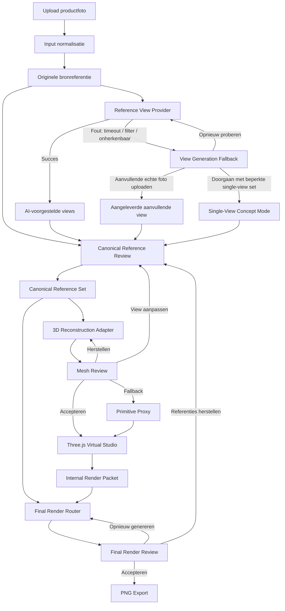

# HupheAI Universal Product Studio
## Masterdocument voor het eerste bouwbare prototype

**Versie:** 1.0  
**Datum:** 20 juni 2026  
**Status:** Goedgekeurde prototypearchitectuur  
**Vervangt:** alle eerdere architectuurschetsen, feedbackblokken en brainstormcorrecties

---

## 1. Doel van dit document

Dit document beschrijft de productvisie, gebruikersflow, technische architectuur, datamodellen, kwaliteitscontroles, foutafhandeling en bouwvolgorde van de HupheAI Universal Product Studio.

Het document is bedoeld als gedeelde bron voor productdesign, frontend, backend en AI-integraties. Implementaties mogen intern veranderen, zolang de functionele contracten en architectuurprincipes uit dit document intact blijven.

De architectuur is bewust modelonafhankelijk. Concrete AI-modellen worden via providers aangesloten en kunnen later worden vervangen zonder de kern van de applicatie opnieuw te bouwen.

---

## 2. Productdefinitie

De Universal Product Studio is een digitale fotostudio waarin een gebruiker vanuit één of meer productfoto’s nieuwe commerciële productbeelden kan maken.

De gebruiker hoeft geen 3D-software, diffusion-workflows of complexe prompttechnieken te begrijpen. De applicatie vertaalt gewone creatieve keuzes naar een combinatie van:

- goedgekeurde 2D-productreferenties;
- een afgeleide 3D-reconstructie;
- een bestuurbare Three.js-studio;
- camera-, lens- en lichtinstellingen;
- een gecontroleerde finale beeldgeneratie.

De gebruiker regisseert het productbeeld. De applicatie beheert onder water de technische reconstructie en generatie.

### 2.1 Productbelofte van het prototype

Het eerste prototype moet aantonen dat een gebruiker:

1. één productfoto kan uploaden;
2. aanvullende productaanzichten kan laten voorstellen;
3. die aanzichten kan beoordelen en aanpassen;
4. een bruikbare 3D-proxy kan laten genereren;
5. het product in een virtuele studio kan positioneren;
6. camera en licht kan instellen;
7. een commercieel productbeeld als PNG kan genereren.

### 2.2 Wat het prototype niet belooft

Het prototype belooft nadrukkelijk niet:

- een CAD-nauwkeurige reconstructie;
- volledige productwaarheid vanuit één foto;
- foutloze reproductie van niet-zichtbare zijden;
- gegarandeerd behoud van kleine tekst of complexe logo’s;
- realtime 2D-naar-3D-bewerking;
- realtime mesh-updates;
- professionele UV-editing;
- LoRA-training per product;
- PSD-, EXR- of lagenexport voor gebruikers;
- betrouwbare reconstructie van ieder materiaal- of producttype.

Het eerste prototype is een **Concept Mode**. Absolute productnauwkeurigheid wordt later onderdeel van een aparte **Fidelity Mode**, waarin meerdere echte productfoto’s worden gevraagd.

---

## 3. Kernprincipes

### 3.1 De originele foto blijft bewijs

Een echte, door de gebruiker geüploade foto is waargenomen informatie. AI-gegenereerde aanzichten zijn interpretaties.

De applicatie mag deze twee nooit stilzwijgend als gelijkwaardig behandelen.

### 3.2 AI-output is pas canoniek na goedkeuring

Een gegenereerde linker-, rechter- of achterkant begint als `inferred`. Pas nadat de gebruiker de view accepteert of bewust aanpast, krijgt deze de status `user-approved` of `user-edited`.

### 3.3 De referentieset bepaalt identiteit

De goedgekeurde 2D-referenties vormen de leidende bron voor:

- silhouet;
- kleur;
- materiaalindruk;
- logo’s;
- graphics;
- herkenbare productdetails.

### 3.4 De mesh is afgeleid

De 3D-mesh is een technisch hulpmiddel voor:

- ruimtelijke vorm;
- perspectief;
- camera;
- depth;
- normals;
- positionering;
- lichtinteractie.

De mesh is geen zelfstandig bewijs van de productidentiteit.

### 3.5 Aanpassingen zijn lineair

Wanneer de gebruiker een referentieview wijzigt, ontstaat een nieuwe versie van de referentieset.

De mesh verandert pas wanneer de gebruiker bewust kiest voor **Genereer nieuwe mesh**. Er vindt in het eerste prototype geen realtime reprojection of realtime mesh-update plaats.

### 3.6 Iedere AI-provider is vervangbaar

De kernapplicatie kent functionele providers, geen onvervangbare modelnamen.

Voorbeelden:

- `ReferenceViewProvider`
- `ReconstructionProvider`
- `FinalRenderProvider`
- `OptionalAnalysisProvider`

### 3.7 Menselijke goedkeuring is onderdeel van de architectuur

De gebruiker is in het prototype de belangrijkste kwaliteitscontrole. De pipeline bevat daarom expliciete reviewmomenten in plaats van één magische knop die stilletjes verkeerde achterkanten verzint.

### 3.8 Falen moet een route hebben

Een mislukte mesh, inconsistente achterkant of beschadigd logo leidt nooit alleen tot een algemene foutmelding.

De gebruiker krijgt altijd een bruikbare vervolgstap:

- opnieuw genereren;
- een view aanpassen;
- een echte foto toevoegen;
- een eerdere versie herstellen;
- een eenvoudige proxyvorm gebruiken;
- de camerabeweging beperken.

---

## 4. Informatie- en betrouwbaarheidsmodel

De eerdere termen `Geometry Truth`, `Identity Truth` en `Art Direction Truth` worden niet gebruikt. Ze suggereren meer zekerheid dan een generatieve reconstructie kan bieden.

De architectuur gebruikt vier informatielagen.

### 4.1 Observed Identity Evidence

Informatie die daadwerkelijk zichtbaar is in een echte gebruikersfoto.

Voorbeelden:

- originele pixels;
- zichtbaar logo;
- zichtbaar etiket;
- waarneembare kleur;
- zichtbare rand;
- zichtbare materiaaleigenschappen;
- zichtbaar silhouet.

### 4.2 Inferred Reference Evidence

Informatie die door een beeldmodel is voorgesteld voor niet-zichtbare of onvolledig zichtbare delen.

Voorbeelden:

- gegenereerde achterkant;
- geïnterpreteerde zijkant;
- doorlopend patroon;
- geschatte opening;
- gereconstrueerde sluiting.

### 4.3 Reconstructed Geometry

De afgeleide technische 3D-representatie.

Voorbeelden:

- mesh;
- PBR-maps;
- depth;
- normals;
- silhouette;
- bounding box;
- schaalverhouding.

Ook wanneer een reconstructiemodel PBR-materialen levert, blijven die afgeleid. Zij worden niet automatisch tot waargenomen productidentiteit verheven.

### 4.4 Art Direction Intent

De creatieve keuzes van de gebruiker.

Voorbeelden:

- camerahoek;
- lens;
- uitsnede;
- achtergrond;
- lichtopstelling;
- schaduw;
- sfeer;
- materiaalaccent;
- preservation policy.

---

## 5. Provenance-statussen

Iedere referentieview en iedere belangrijke productregio krijgt waar mogelijk een herkomststatus.

| Status | Betekenis |
|---|---|
| `observed` | Afkomstig uit een echte gebruikersfoto |
| `inferred` | Door AI gegenereerd of afgeleid |
| `user-approved` | Door de gebruiker bewust geaccepteerd |
| `user-edited` | Door de gebruiker bewust gewijzigd |
| `reconstructed` | Afgeleid uit een 3D-reconstructie |
| `superseded` | Vervangen door een nieuwere versie |
| `rejected` | Door de gebruiker afgewezen |

Een `user-approved` view blijft technisch gezien een goedgekeurde interpretatie. De status betekent niet dat de view objectief waar is. Hij betekent dat de gebruiker hem als canonieke ontwerpbeslissing heeft geaccepteerd.

---

## 6. Architectuuroverzicht



De architectuur bestaat uit tien functionele onderdelen:

1. Input Contract
2. Input Normalisation
3. Reference View Synthesis
4. Canonical Reference Review
5. 3D Reconstruction Adapter
6. Mesh Review
7. Virtual Studio
8. Internal Render Packet
9. Final Render Router
10. Review, Versioning en Export

---

## 7. Volledige gebruikersflow

## 7.1 Stap 1: project aanmaken

De gebruiker maakt een nieuw Product Studio-project aan.

Verplichte projectgegevens:

- projectnaam;
- originele productfoto;
- gewenste outputverhouding.

Optionele gegevens:

- productnaam;
- productcategorie;
- bekende producthoogte of -breedte;
- merknaam;
- aanvullende echte foto’s;
- korte beschrijving van belangrijke details.

### Acceptatievoorwaarden

- minimaal één geldige afbeelding;
- ondersteunde bestandsindeling;
- voldoende resolutie;
- bestand is succesvol opgeslagen;
- originele bron blijft onaangetast bewaard.

---

## 7.2 Stap 2: input normaliseren

De backend maakt werkbestanden zonder het origineel te overschrijven.

Taken:

- EXIF-oriëntatie corrigeren;
- kleurprofiel normaliseren;
- transparantie correct verwerken;
- maximale werkresolutie bepalen;
- objectmasker genereren;
- bounding box bepalen;
- product centreren op een neutraal werkcanvas;
- checksum berekenen;
- thumbnail genereren.

### Background removal

Background removal is een technische voorbewerking, geen bronwaarheid.

De applicatie bewaart:

- origineel;
- automatisch objectmasker;
- vrijstaand werkbeeld;
- eventuele handmatige maskercorrectie.

Wanneer de automatische uitsnede twijfelachtig is, krijgt de gebruiker vóór verdere generatie een eenvoudige mask-review.

---

## 7.3 Stap 3: aanvullende referentieviews genereren

De originele foto blijft de primaire `observed` referentie.

De `ReferenceViewProvider` genereert aanvullende aanzichten, standaard:

- links;
- rechts;
- achter.

Optioneel kan ook een top view worden gegenereerd wanneer die relevant is voor de productcategorie.

### Initiële providerstrategie

Voor het eerste prototype:

- standaardprovider: Gemini 3.1 Flash Image;
- kwaliteitsfallback: Gemini 3.1 Pro Image;
- providers worden via configuratie gekozen;
- modelnamen worden niet hard in de domeinlogica verwerkt.

### Voorkeursmethode: consistente turnaround

De eerste poging genereert één gezamenlijke 2x2-turnaround of contact sheet met:

- originele of gereconstrueerde front/hero view;
- linkerprofiel;
- rechterprofiel;
- achterkant;
- gelijke schaal;
- gelijke producthoogte;
- neutrale achtergrond;
- zo min mogelijk perspectiefvertekening;
- gelijke lichtcondities.

Daarna normaliseert de backend de panelen naar afzonderlijke views.

### Fallbackmethode

Wanneer de contact sheet niet betrouwbaar te splitsen is:

1. genereer de views afzonderlijk;
2. gebruik dezelfde conversation context;
3. stuur de reeds goedgekeurde views opnieuw mee;
4. houd camera-, schaal- en achtergrondinstructies identiek.

### Belangrijke beperking

De aanvullende views zijn plausibele interpretaties. Zij zijn geen gemeten orthografische reconstructies en worden niet automatisch als waarheid opgeslagen.

---

## 7.4 Stap 4: Canonical Reference Review

De gebruiker ziet alle beschikbare views in één overzicht.

Per view kan de gebruiker:

- accepteren;
- afwijzen;
- opnieuw genereren;
- aanpassen via prompt;
- vervangen door een echte foto;
- teruggaan naar een vorige versie.

De UI toont duidelijk de status:

- echte foto;
- AI-voorstel;
- door gebruiker geaccepteerd;
- door gebruiker aangepast.

### Canonical Reference Set

Wanneer minimaal één observed hero/front view beschikbaar is, kan de backend een nieuwe `CanonicalReferenceSetVersion` maken. Aanvullende views worden opgenomen wanneer zij beschikbaar en goedgekeurd zijn. Wanneer alleen de hero view beschikbaar is, wordt de set gemarkeerd als `limited-single-view`.

Deze set bevat:

- alle actieve views;
- provenance per view;
- prompt- en providerinformatie;
- crop- en camerametadata;
- versie;
- tijdstip;
- gebruiker die de set accepteerde.

### Regel

Een nieuwe of gewijzigde view verandert nooit stilzwijgend een bestaande goedgekeurde set. Er wordt altijd een nieuwe versie gemaakt.

---

## 7.5 Stap 5: 3D-reconstructie

De `ReconstructionProvider` vertaalt de goedgekeurde referenties naar een werkbare 3D-representatie.

### Route A: primaire MVP-route

Gebruik één gekozen canonical hero view als input voor TRELLIS.2.

De overige canonical views worden gebruikt voor:

- visuele validatie;
- vergelijking van silhouet;
- beoordeling van zij- en achterkant;
- herstelbeslissingen.

Deze route is de standaard omdat de officiële TRELLIS.2-interface single-image-to-3D is.

### Route B: experimentele multiview-route

Gebruik een provider die expliciet meerdere views accepteert.

Een mogelijke testprovider is een multiview-TRELLIS-endpoint. Deze route wordt alleen geactiveerd nadat hij op de interne benchmark aantoonbaar beter presteert dan de single-view-route.

De multiview-route mag niet worden verward met TRELLIS.2 wanneer de onderliggende provider een andere modelversie gebruikt.

### Route C: primitive proxy fallback

Wanneer automatische reconstructie onvoldoende bruikbaar is, kiest de gebruiker een eenvoudige proxy:

- box;
- cylinder;
- sphere;
- plane.

Later kunnen worden toegevoegd:

- capsule;
- extruded silhouette;
- revolved silhouette voor flessen en vazen;
- handmatige proporties.

### Output van ReconstructionProvider

Minimaal:

- GLB of glTF;
- preview-render;
- bounding box;
- schaalmetadata;
- provider en modelversie;
- seed en instellingen;
- status;
- logs;
- eventuele PBR-materialen.

Optioneel:

- OBJ;
- base color;
- roughness;
- metallic;
- opacity;
- normal map.

---

## 7.6 Stap 6: Mesh Review

Na iedere nieuwe reconstructie toont de applicatie vaste controlebeelden:

- hero/front;
- links;
- rechts;
- achter;
- eventueel top;
- turntable-preview.

De controlecamera’s worden vastgelegd zodat versies eerlijk vergelijkbaar blijven.

### De gebruiker kan:

- mesh accepteren;
- opnieuw genereren;
- andere hero view kiezen;
- canonical view aanpassen;
- extra echte foto toevoegen;
- primitive proxy kiezen;
- vorige meshversie herstellen.

### Verplichte review na wijziging

Wanneer één canonical view wordt aangepast en een nieuwe mesh wordt gegenereerd, vergelijkt de UI:

- vorige mesh versus nieuwe mesh;
- vorige controleviews versus nieuwe controleviews;
- nieuwe mesh versus actuele canonical views.

Minimaal wordt een opacity- of silhouette-overlay aangeboden.

### Acceptatiepoort

Een mesh krijgt pas de status `approved` nadat de gebruiker hem expliciet accepteert.

---

## 7.7 Stap 7: Three.js Virtual Studio

De goedgekeurde mesh of proxy wordt geladen in de Three.js-studio.

### Minimale studiofuncties

#### Product

- verplaatsen;
- roteren;
- schalen;
- resetten;
- centreren;
- hoogte ten opzichte van grondvlak instellen.

#### Camera

- orbit;
- pan;
- zoom/dolly;
- focal length;
- camera-afstand;
- portret-, vierkant- en landschapskader;
- vaste camera-presets;
- reset camera.

#### Licht

- key light;
- fill light;
- rim light;
- intensiteit;
- positie;
- grootte van area light;
- kleurtemperatuur of kleur;
- licht aan/uit;
- lichtpreset laden.

#### Scène

- achtergrondkleur;
- eenvoudige achtergrondgradient;
- ground plane;
- schaduw aan/uit;
- object shadow;
- ambient light;
- eenvoudige HDRI-optie, indien technisch haalbaar.

### Fysieke schaal

Wanneer de gebruiker één echte maat opgeeft, bijvoorbeeld producthoogte, gebruikt de studio die om:

- de 3D-schaal te normaliseren;
- camera-afstanden begrijpelijk te maken;
- lichtgrootte realistischer te behandelen.

Zonder bekende maat werkt de studio met relatieve eenheden.

### Safe Camera Zone

De UI mag aangeven hoeveel van een camerahoek is gebaseerd op:

- observed views;
- goedgekeurde inferred views;
- uitsluitend gereconstrueerde informatie.

In Concept Mode blokkeert de app de camera niet standaard, maar toont hij een waarschuwing bij sterk onzekere hoeken.

---

## 7.8 Stap 8: Internal Render Packet

Wanneer de gebruiker op **Preview genereren** of **Final genereren** klikt, maakt de studio een gestandaardiseerd renderpakket.

### Minimale interne output

- `beauty.png`
- `object-mask.png`
- `depth.png` of `depth.exr`
- `normal.png`
- `camera.json`
- `lighting.json`
- `scene.json`
- verwijzingen naar de actieve Canonical Reference Set
- verwijzing naar Reconstruction Version
- outputformaat en aspect ratio

### Aanvullende output indien beschikbaar

- `albedo.png`
- `roughness.png`
- `metallic.png`
- `opacity.png`
- `shadow.png`
- `ambient-occlusion.png`
- `logo-mask.png`
- `text-mask.png`

Deze bestanden zijn intern. De gebruiker hoeft ze in het eerste prototype niet afzonderlijk te downloaden.

---

## 7.9 Stap 9: finale beeldgeneratie

De `FinalRenderRouter` vertaalt het renderpakket en de canonical references naar een commercieel productbeeld.

### MVP-strategie

De router is technisch verwisselbaar, maar kiest in de eerste versie via vaste configuratie één standaardprovider.

Mogelijke providers:

- Gemini 3.1 Flash Image;
- Gemini 3.1 Pro Image;
- GPT Image;
- custom ComfyUI-workflow.

Automatische providerselectie wordt pas toegevoegd nadat een benchmark voldoende gegevens oplevert.

### Provider-specifieke input

#### Native image-edit provider

Ontvangt bijvoorbeeld:

- beauty preview;
- objectmasker;
- geselecteerde canonical references;
- art-direction prompt;
- preservation policy;
- outputratio;
- gewenste resolutie.

#### ComfyUI-provider

Kan aanvullend ontvangen:

- depth;
- normals;
- albedo;
- masks;
- ControlNet-configuratie;
- image conditioning;
- provider-specifieke denoise en guidance.

### Preservation Policy

De gebruikersintentie wordt modelonafhankelijk vastgelegd.

| Policy | Gedrag |
|---|---|
| `strict` | Productidentiteit maximaal behouden; weinig creatieve vrijheid |
| `balanced` | Product behouden, maar licht, materiaalindruk en sfeer mogen sterker worden verbeterd |
| `creative` | Vrijere commerciële interpretatie; alleen geschikt voor conceptbeelden |

De backend vertaalt deze policy naar provider-specifieke instellingen.

Er bestaat geen universele denoise-waarde in de domeinarchitectuur.

### Beschermde regio’s

Wanneer logo-, tekst- of identiteitsmaskers beschikbaar zijn, behandelt de provider deze als beschermde gebieden.

Een final render mag deze regio’s niet zonder waarschuwing wijzigen.

---

## 7.10 Stap 10: Final Render Review

De gebruiker ziet:

- finale render;
- originele bronfoto;
- gekozen canonical view;
- Three.js beauty preview;
- optionele voor/na-slider.

De gebruiker kan:

- accepteren;
- opnieuw genereren;
- preservation policy wijzigen;
- licht of camera aanpassen;
- een specifieke referentie aanpassen;
- teruggaan naar een eerdere render;
- teruggaan naar een eerdere mesh;
- het resultaat downloaden.

### Prototype-export

De enige gebruikersoutput in versie 1 is:

- platte RGB-PNG.

Ondersteunde exportopties:

- 1K preview;
- 2K final;
- 4K alleen wanneer provider en kosten dit toelaten;
- gekozen aspect ratio.

Transparante export, PSD, lagen, EXR en losse schaduwpasses vallen buiten het eerste prototype.

---

## 8. Functionele componenten

## 8.1 InputService

Verantwoordelijk voor:

- uploadvalidatie;
- bestandopslag;
- metadata;
- normalisatie;
- checksums;
- thumbnails;
- objectmaskers;
- bronprovenance.

Niet verantwoordelijk voor:

- referentieviewgeneratie;
- reconstructie;
- finale rendering.

---

## 8.2 ReferenceViewService

Verantwoordelijk voor:

- provider aanroepen;
- prompts en context samenstellen;
- contact sheets verwerken;
- views normaliseren;
- provenance opslaan;
- regeneraties;
- viewversies.

Interfacevoorbeeld:

```ts
export interface ReferenceViewProvider {
  generateViews(input: {
    sourceImageUrl: string;
    existingViews?: ReferenceViewInput[];
    targetViews: Array<"left" | "right" | "rear" | "top">;
    productNotes?: string;
    consistencyMode: "turnaround" | "single-view-repair";
  }): Promise<ReferenceViewProviderResult>;
}
```

---

## 8.3 CanonicalReferenceService

Verantwoordelijk voor:

- actieve views selecteren;
- approval-statussen;
- nieuwe setversies;
- immutable versioning;
- provenance;
- historie;
- terugzetten.

Een bestaande goedgekeurde set wordt nooit in place overschreven.

---

## 8.4 ReconstructionService

Verantwoordelijk voor:

- providerselectie;
- reconstructiejobs;
- jobstatussen;
- providerinstellingen;
- outputvalidatie;
- meshbestanden;
- PBR-output;
- retries;
- versiebeheer.

Interfacevoorbeeld:

```ts
export interface ReconstructionProvider {
  createReconstruction(input: {
    canonicalReferenceSetId: string;
    primaryImageUrl: string;
    additionalImageUrls?: string[];
    route: "single-view" | "multi-view";
    quality: "preview" | "final";
    seed?: number;
  }): Promise<ReconstructionJobResult>;
}
```

---

## 8.5 StudioSceneService

Verantwoordelijk voor het bewaren van:

- producttransformatie;
- camera;
- lens;
- verlichting;
- achtergrond;
- ground plane;
- outputratio;
- studio-presets;
- actieve reconstructieversie.

Een project kan meerdere studio-scèneversies hebben.

---

## 8.6 RenderPacketService

Verantwoordelijk voor:

- deterministische Three.js-render;
- interne passes;
- metadata;
- bestandsnamen;
- validatie;
- koppeling aan scène- en referentieversies.

Iedere final render moet later reproduceerbaar zijn uit:

- Canonical Reference Set Version;
- Reconstruction Version;
- Studio Scene Version;
- Render Packet Version;
- providerconfiguratie.

---

## 8.7 FinalRenderService

Verantwoordelijk voor:

- providerselectie;
- promptconstructie;
- preservation policy;
- beschermde maskers;
- jobs;
- retries;
- outputopslag;
- kostenregistratie;
- finale renderversies.

Interfacevoorbeeld:

```ts
export interface FinalRenderProvider {
  render(input: {
    beautyUrl: string;
    canonicalReferenceUrls: string[];
    objectMaskUrl?: string;
    depthUrl?: string;
    normalUrl?: string;
    protectedRegionUrls?: string[];
    artDirectionPrompt: string;
    preservationPolicy: "strict" | "balanced" | "creative";
    aspectRatio: string;
    resolution: "1k" | "2k" | "4k";
  }): Promise<FinalRenderProviderResult>;
}
```

---

## 9. Datamodel

Onderstaand model is conceptueel. De uiteindelijke databasevelden mogen aan de gebruikte stack worden aangepast.

## 9.1 ProductProject

```ts
interface ProductProject {
  id: string;
  ownerId: string;
  name: string;
  mode: "concept" | "fidelity";
  status:
    | "draft"
    | "references_pending"
    | "references_review"
    | "reconstruction_pending"
    | "mesh_review"
    | "studio_ready"
    | "render_pending"
    | "completed"
    | "archived";
  createdAt: string;
  updatedAt: string;
}
```

## 9.2 SourceAsset

```ts
interface SourceAsset {
  id: string;
  projectId: string;
  type:
    | "original-image"
    | "normalized-image"
    | "object-mask"
    | "manual-mask"
    | "thumbnail";
  url: string;
  mimeType: string;
  width: number;
  height: number;
  checksum: string;
  provenance: "observed";
  createdAt: string;
}
```

## 9.3 ReferenceView

```ts
interface ReferenceView {
  id: string;
  projectId: string;
  angle: "hero" | "front" | "left" | "right" | "rear" | "top" | "custom";
  assetUrl: string;
  sourceAssetId?: string;
  providerRunId?: string;
  provenance:
    | "observed"
    | "inferred"
    | "user-approved"
    | "user-edited"
    | "reconstructed";
  status: "draft" | "active" | "rejected" | "superseded";
  parentViewId?: string;
  prompt?: string;
  version: number;
  createdAt: string;
}
```

## 9.4 CanonicalReferenceSetVersion

```ts
interface CanonicalReferenceSetVersion {
  id: string;
  projectId: string;
  version: number;
  viewIds: string[];
  status: "draft" | "approved" | "superseded";
  coverage: "limited-single-view" | "partial-multiview" | "full-multiview";
  approvedBy?: string;
  approvedAt?: string;
  createdAt: string;
}
```

`status` beschrijft de goedkeuringsstatus van de versie. `coverage` beschrijft de volledigheid van de referentieset, onafhankelijk van goedkeuring. Een set kan `approved` zijn met `limited-single-view` coverage wanneer de gebruiker bewust heeft gekozen door te gaan zonder aanvullende views.

## 9.5 ReconstructionVersion

```ts
interface ReconstructionVersion {
  id: string;
  projectId: string;
  canonicalReferenceSetId: string;
  providerRunId: string;
  route: "single-view" | "multi-view" | "primitive-proxy";
  meshUrl: string;
  previewUrl?: string;
  pbrAssetUrls?: Record<string, string>;
  status: "processing" | "review" | "approved" | "rejected" | "failed";
  seed?: number;
  parentVersionId?: string;
  createdAt: string;
  approvedAt?: string;
}
```

## 9.6 StudioSceneVersion

```ts
interface StudioSceneVersion {
  id: string;
  projectId: string;
  reconstructionVersionId: string;
  camera: CameraState;
  lights: LightState[];
  productTransform: TransformState;
  environment: EnvironmentState;
  output: OutputState;
  version: number;
  createdAt: string;
}
```

## 9.7 RenderPacket

```ts
interface RenderPacket {
  id: string;
  projectId: string;
  canonicalReferenceSetId: string;
  reconstructionVersionId: string;
  studioSceneVersionId: string;
  beautyUrl: string;
  objectMaskUrl: string;
  depthUrl?: string;
  normalUrl?: string;
  auxiliaryAssetUrls?: Record<string, string>;
  metadataUrl: string;
  createdAt: string;
}
```

## 9.8 ProviderRun

```ts
interface ProviderRun {
  id: string;
  projectId: string;
  providerType:
    | "reference-view"
    | "reconstruction"
    | "final-render"
    | "analysis";
  providerName: string;
  modelName: string;
  status: "queued" | "processing" | "completed" | "failed" | "cancelled";
  requestHash: string;
  externalRequestId?: string;
  inputManifestUrl?: string;
  outputManifestUrl?: string;
  latencyMs?: number;
  costEstimate?: number;
  errorCode?: string;
  errorMessage?: string;
  createdAt: string;
  completedAt?: string;
}
```

## 9.9 FinalRenderVersion

```ts
interface FinalRenderVersion {
  id: string;
  projectId: string;
  renderPacketId: string;
  providerRunId: string;
  outputUrl: string;
  preservationPolicy: "strict" | "balanced" | "creative";
  prompt: string;
  resolution: "1k" | "2k" | "4k";
  status: "review" | "approved" | "rejected" | "failed";
  parentVersionId?: string;
  createdAt: string;
  approvedAt?: string;
}
```

---

## 10. Job- en queuearchitectuur

AI- en reconstructietaken worden niet als één blokkerende HTTP-request uitgevoerd.

### Jobtypen

- `GENERATE_REFERENCE_VIEWS`
- `REGENERATE_REFERENCE_VIEW`
- `GENERATE_RECONSTRUCTION`
- `GENERATE_CONTROL_RENDERS`
- `BUILD_RENDER_PACKET`
- `GENERATE_FINAL_RENDER`
- `GENERATE_EXPORT`

### Statussen

- `queued`
- `processing`
- `needs_review`
- `completed`
- `failed`
- `cancelled`

### Vereisten

- idempotency key per job;
- provider request ID bewaren;
- webhook waar provider dit ondersteunt;
- polling als fallback;
- beperkte automatische retries;
- duidelijke foutcodes;
- logs zonder geheime sleutels;
- hervatten na browserrefresh;
- voortgang zichtbaar in de UI.

### Retrybeleid

Automatisch opnieuw proberen bij:

- netwerkfout;
- tijdelijke providerstoring;
- rate limit;
- verlopen tijdelijke URL, wanneer veilig opnieuw te tekenen.

Niet automatisch opnieuw proberen bij:

- ongeldige input;
- moderatieblokkade;
- ontbrekende rechten;
- structureel corrupt bestand;
- herhaald identiek providerresultaat.

---

## 11. Failure UX

## 11.1 Upload of mask mislukt

**UI-response:**

- toon origineel;
- laat automatische uitsnede opnieuw uitvoeren;
- bied handmatige maskercorrectie;
- laat gebruiker doorgaan zonder uitsnede wanneer technisch mogelijk.

## 11.2 Referentieview is inconsistent

**UI-response:**

- markeer de view als AI-voorstel;
- toon opnieuw genereren;
- toon aanpassen;
- toon echte foto uploaden;
- gebruik de view niet in een approved set zolang hij niet is geaccepteerd.

## 11.3 Achterkant is onbekend

**UI-response:**

- waarschuwing: “Deze zijde is door AI geïnterpreteerd”;
- echte foto toevoegen;
- view bewust goedkeuren;
- camerahoek beperken;
- Concept Mode voortzetten.

## 11.4 Mesh heeft gaten of vervormingen

**UI-response:**

- opnieuw genereren met andere seed;
- andere primary view kiezen;
- extra echte foto toevoegen;
- multiview-route proberen;
- primitive proxy kiezen;
- vorige meshversie herstellen.

## 11.5 Mesh verandert onbedoelde delen na een view-edit

**UI-response:**

- vergelijkingsweergave openen;
- oude mesh behouden;
- nieuwe mesh afwijzen;
- andere reconstructieroute proberen;
- terug naar vorige Canonical Reference Set.

## 11.6 Logo of tekst verandert in final render

**UI-response:**

- waarschuwing tonen;
- opnieuw genereren met `strict`;
- beschermd masker toevoegen;
- lokaal herstel als toekomstige uitbreiding;
- terugvallen op Three.js beauty preview wanneer identiteit belangrijker is dan polish.

## 11.7 Provider is niet beschikbaar

**UI-response:**

- jobstatus bewaren;
- later opnieuw proberen;
- geconfigureerde fallbackprovider gebruiken;
- nooit een volledig project verliezen.

## 11.8 Kosten- of resolutielimiet bereikt

**UI-response:**

- eerst preview aanbieden;
- lagere resolutie voorstellen;
- duidelijk kostenverschil tonen;
- bestaande goedgekeurde output beschikbaar houden.

---

## 12. Kwaliteitspoorten

## Gate 1: Input Ready

Voorwaarden:

- origineel opgeslagen;
- checksum bekend;
- werkbeeld beschikbaar;
- product voldoende zichtbaar;
- masker geaccepteerd of bewust overgeslagen.

## Gate 2: References Approved

Voorwaarden:

- minimaal één observed hero view aanwezig;
- elke actieve inferred view expliciet geaccepteerd of aangepast;
- Canonical Reference Set Version aangemaakt.

Wanneer de gebruiker doorgaat zonder aanvullende views, krijgt de Canonical Reference Set de status `limited-single-view`. De gebruiker wordt gewaarschuwd dat reconstructie en vrije camerabeweging minder betrouwbaar zijn. De safe camera zone wordt automatisch beperkt tot de hoeken die aansluiten op de beschikbare observed view.

## Gate 3: Reconstruction Approved

Voorwaarden:

- mesh of proxy kan worden geladen;
- bounding box is geldig;
- controleviews zijn gegenereerd;
- gebruiker heeft de reconstructie geaccepteerd.

## Gate 4: Studio Ready

Voorwaarden:

- geldige camera;
- product in frame;
- lichtconfiguratie geldig;
- outputratio gekozen;
- actieve reconstructieversie bekend.

## Gate 5: Render Ready

Voorwaarden:

- renderpacket compleet;
- minimaal beauty en objectmasker aanwezig;
- canonical references bereikbaar;
- preservation policy bekend;
- providerconfiguratie geldig.

## Gate 6: Export Ready

Voorwaarden:

- finale PNG succesvol gegenereerd;
- gebruiker heeft output geaccepteerd;
- bestandsmetadata opgeslagen;
- download-URL beschikbaar.

---

## 13. Preview versus Final

## Preview

Doel:

- snelle compositiecontrole;
- lage kosten;
- korte wachttijd;
- iteratie op camera en licht.

Eigenschappen:

- maximaal 1K;
- snellere provider;
- minder sampling of lagere 3D-resolutie;
- watermark alleen indien productmatig gewenst;
- niet automatisch als final markeren.

## Final

Doel:

- goedgekeurde commerciële output.

Eigenschappen:

- 2K standaard;
- 4K optioneel;
- kwaliteitsprovider;
- strict of balanced preservation;
- alle actieve beschermde regio’s;
- outputversie permanent bewaren.

---

## 14. Kosten- en performancebeleid

### Principes

- genereer referentieviews niet opnieuw zonder inhoudelijke wijziging;
- hergebruik goedgekeurde assets;
- cache providerresultaten op basis van inputhash en configuratie;
- bouw previews vóór finals;
- registreer kosten per ProviderRun;
- maak hoge resolutie een bewuste actie;
- voorkom automatische ketens van dure regeneraties.

### Request hash

Een request hash bevat minimaal:

- input asset checksums;
- provider;
- model;
- promptversie;
- relevante instellingen;
- seed;
- gewenste output.

Identieke requests mogen waar passend een bestaand resultaat hergebruiken.

---

## 15. Opslag, privacy en beveiliging

### Vereisten

- uploads standaard privé opslaan;
- signed URLs gebruiken;
- provider-API-sleutels uitsluitend server-side bewaren;
- nooit een fal- of andere geheime sleutel in de browser plaatsen;
- toegangscontrole per project;
- verwijdering van projectassets ondersteunen;
- providerretentie en gebruiksvoorwaarden documenteren;
- logs ontdoen van gevoelige URLs en tokens;
- origineel en afgeleide assets duidelijk onderscheiden.

### Rechten

De gebruiker bevestigt dat hij het recht heeft de geüploade productbeelden te gebruiken.

### Verwijdering

Bij projectverwijdering:

- database-entiteiten verwijderen of anonimiseren;
- eigen opgeslagen assets verwijderen;
- externe providerbestanden verwijderen waar de provider dit ondersteunt;
- verwijderstatus loggen.

---

## 16. Observability

Per providerjob wordt geregistreerd:

- provider;
- model;
- endpoint;
- starttijd;
- eindtijd;
- latency;
- retry count;
- kosten;
- foutcode;
- outputgrootte;
- gebruikeractie na output;
- geaccepteerd of afgewezen.

Deze data is nodig om later betrouwbare providerkeuzes te maken.

---

## 17. Benchmarkplan

Automatische modelrouting wordt pas gebouwd nadat providers op een vaste testset zijn beoordeeld.

### Testset

Minimaal:

1. matte doos zonder tekst;
2. matte doos met eenvoudig logo;
3. verpakking met groter etiket;
4. ondoorzichtige fles;
5. keramieken vaas;
6. schoen;
7. tas met hardware;
8. glanzend blikje;
9. transparante fles;
10. reflecterend of metallic product.

Per categorie meerdere voorbeelden.

### Beoordelingscriteria

- behoud van silhouet;
- behoud van proporties;
- behoud van kleur;
- behoud van logo;
- behoud van tekst;
- materiaalweergave;
- geometrische consistentie;
- bruikbaarheid van achterkant;
- kwaliteit van schaduw;
- kwaliteit van achtergrond;
- latency;
- kosten;
- foutpercentage;
- menselijk acceptatiepercentage.

### Beslisregel

Een nieuw model vervangt de standaardprovider alleen wanneer het op de relevante categorie aantoonbaar beter of duidelijk goedkoper is zonder kritieke kwaliteitsdaling.

---

## 18. MVP-bouwvolgorde

## Fase 0: technische spikes

Doel: de grootste onzekerheden los testen vóór volledige UI-bouw.

Spikes:

1. Gemini-turnaround uit één foto;
2. contact sheet betrouwbaar splitsen;
3. TRELLIS.2 single-view via fal;
4. multiview-TRELLIS versus TRELLIS.2 vergelijken;
5. GLB in Three.js laden;
6. beauty, mask, depth en normals exporteren;
7. beauty plus references door final image provider sturen.

Elke spike levert voorbeeldassets, latency, kosten en bekende beperkingen op.

## Fase 1: verticale basisflow

Bouw:

- project aanmaken;
- één foto uploaden;
- normaliseren;
- drie aanvullende views genereren;
- views accepteren;
- single-view TRELLIS.2-reconstructie;
- GLB tonen;
- mesh accepteren;
- eenvoudige Three.js-studio;
- beauty preview exporteren;
- finale PNG genereren.

Nog niet bouwen:

- automatische modelrouter;
- complexe validatiescore;
- realtime updates;
- lokale view repair;
- Fidelity Mode;
- transparante export.

## Fase 2: betrouwbare review en versioning

Bouw:

- Canonical Reference Set Versions;
- Reconstruction Versions;
- control renders;
- voor/na-overlay;
- rollback;
- jobqueue;
- providerlogs;
- duidelijke failure UX.

## Fase 3: studiokwaliteit

Bouw:

- lensinstellingen;
- lichtpresets;
- fysieke schaal;
- betere schaduwen;
- renderpasses;
- preservation policies;
- 2K finals;
- providerbenchmark.

## Fase 4: aanvullende input en fidelity

Bouw:

- meerdere echte foto’s uploaden;
- echte views laten prevaleren;
- Fidelity Mode;
- multiview-reconstructie wanneer bewezen;
- OCR- en logo-waarschuwingen;
- beschermde regio’s.

## Fase 5: geavanceerde bewerking

Pas later onderzoeken:

- lokale 2D-reparatie;
- edit propagation;
- region-based regeneration;
- automatische kwaliteitswaarschuwingen;
- slimme providerrouter;
- transparante export;
- PSD-achtige lagen;
- LoRA alleen wanneer een echte use case dat rechtvaardigt.

---

## 19. Eerste testcategorie

De eerste end-to-end-test gebruikt:

- een matte rechthoekige verpakking;
- neutrale achtergrond;
- geen reflecterend materiaal;
- geen kleine tekst;
- geen transparantie;
- eenvoudige kleurverdeling.

Daarna wordt één moeilijkheidsfactor per stap toegevoegd:

1. eenvoudig logo;
2. groter etiket;
3. ronde vorm;
4. organische vorm;
5. glans;
6. doorlopende graphics;
7. kleine tekst;
8. transparantie;
9. metallic reflecties.

Een blikje is geen eerste testobject. De cilindrische vorm is eenvoudig, maar doorlopende graphics, kleine tekst en metalen reflecties maken het als geheel onnodig lastig.

---

## 20. Productbeslissingen

### ADR-001: Canonical references leiden identiteit

**Besluit:** De goedgekeurde 2D-referenties zijn de primaire identity source.

### ADR-002: Mesh is afgeleid

**Besluit:** De mesh is operational geometry en geen zelfstandig bewijs van identiteit.

### ADR-003: Geen LoRA in prototype

**Besluit:** Product-LoRA-training valt buiten versie 1.

### ADR-004: Lineaire regeneratie

**Besluit:** Een aangepaste view leidt pas na expliciete gebruikersactie tot een nieuwe mesh.

### ADR-005: Human-in-the-loop

**Besluit:** Reference Review en Mesh Review zijn verplichte architectuurstappen.

### ADR-006: Provider abstraction

**Besluit:** Domeinlogica verwijst naar providerfuncties, niet naar vaste modelnamen.

### ADR-007: TRELLIS.2 single-view als primaire reconstructieroute

**Besluit:** Multiview wordt experimenteel getest en is geen vereiste voor de eerste verticale flow.

### ADR-008: Flat PNG als gebruikersoutput

**Besluit:** Interne passes worden opgeslagen, maar de prototype-export is één RGB-PNG.

### ADR-009: Concept Mode eerst

**Besluit:** Vanuit één foto wordt plausibele, art-directable output geleverd. Exacte productfidelity volgt later.

### ADR-010: Geen universele denoise

**Besluit:** De domeinlaag gebruikt preservation policies; provider-specifieke parameters blijven in adapters.

---

## 21. Definitie van een geslaagd prototype

Het prototype is geslaagd wanneer een testgebruiker zonder technische begeleiding:

1. een productfoto uploadt;
2. begrijpt welke views echt en welke gegenereerd zijn;
3. gegenereerde views kan accepteren of vervangen;
4. een mesh kan genereren en beoordelen;
5. het product zichtbaar kan positioneren;
6. camera en licht kan aanpassen;
7. een preview kan genereren;
8. een finale PNG kan maken;
9. een mislukte tussenstap kan herstellen zonder het project opnieuw te beginnen.

Technische acceptatie:

- alle externe taken zijn hervatbaar;
- versies zijn terug te zetten;
- providerfouten verliezen geen projectdata;
- API-sleutels blijven server-side;
- iedere final render is terug te voeren op de gebruikte referentie-, mesh- en studioversie;
- de eerste testcategorie levert in een meerderheid van de gevallen een door mensen bruikbaar productbeeld op.

---

## 22. Open experimenten met beslismoment

Deze punten zijn geen losse vragen, maar afgebakende experimenten.

### Experiment A: turnaround-generatie

Vergelijk:

- één 2x2-contact sheet;
- drie losse generations binnen dezelfde conversation context.

**Beslismoment:** kies de methode met de hoogste visuele consistentie en beste automatische uitsnede.

### Experiment B: reconstructieroute

Vergelijk:

- TRELLIS.2 single-view;
- multiview-TRELLIS;
- primitive proxy voor eenvoudige verpakkingen.

**Beslismoment:** kies per productcategorie de eenvoudigste route die de reviewpoort haalt.

### Experiment C: final render provider

Vergelijk minimaal:

- Gemini 3.1 Flash Image;
- Gemini 3.1 Pro Image;
- één GPT Image-configuratie;
- één ComfyUI-workflow.

**Beslismoment:** stel eerst een statische standaardprovider in. Bouw automatische routing pas na voldoende meetdata.

### Experiment D: interne renderpasses

Bepaal welke passes aantoonbaar bijdragen aan betere output.

**Beslismoment:** behoud alleen passes die een provider werkelijk gebruikt of die noodzakelijk zijn voor validatie en toekomstig herstel.

---

## 23. Samenvatting van de definitieve architectuur

De gebruiker uploadt minimaal één echte productfoto. Die foto blijft onaangetast bewaard en wordt gemarkeerd als `observed`.

Een verwisselbare Reference View Provider maakt aanvullende productaanzichten. Deze beginnen als `inferred` en worden pas na menselijke beoordeling onderdeel van een Canonical Reference Set.

Een Reconstruction Adapter maakt uit de goedgekeurde referenties een werkbare mesh. In het eerste prototype is TRELLIS.2 single-view de primaire route. Andere views worden gebruikt voor controle. Multiview-reconstructie blijft een experimentele route totdat zij aantoonbaar beter werkt.

De gebruiker beoordeelt de mesh. Pas daarna wordt deze in de Three.js-studio gebruikt voor camera, lens, licht, compositie, depth, normals en overige interne passes.

Een Final Render Provider combineert de studiopreview, canonical references, maskers en art direction tot een commerciële afbeelding. De gebruiker beoordeelt het resultaat en exporteert een platte PNG.

De architectuur kiest bewust voor controleerbare, versieerbare stappen. Niet voor de illusie dat één AI-call uit één foto automatisch de complete productwaarheid kan destilleren.
