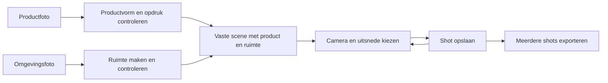

**Product Studio — technische review en verbeteradvies, 8 september 2026**

De grootste verbetering is één blijvende 3D-scène met meerdere opgeslagen camerashots. De huidige code bevat hiervoor bruikbare onderdelen, maar verbindt de wereld nog sterk aan afzonderlijke renderarchieven. Daarnaast zitten er concrete fouten in de reconstructie, assetverwerking en export. Die verdienen voorrang op het aansluiten van extra generatiemodellen.

Uitgangspunt voor dit advies: het product moet herkenbaar en vast blijven, met een overtuigende omgeving die bij alle shots dezelfde is. Eén foto bevat geen waarneming van achterkanten en verborgen delen van een kamer. Een gegenereerde aanvulling kan na goedkeuring wel een vaste wereld worden. Als de werkelijk bestaande ruimte nauwkeurig moet worden gereconstrueerd, is een echte fotoserie of video met overlappende standpunten nodig. De [COLMAP-opnamerichtlijnen](https://colmap.github.io/tutorial.html) beschrijven de eisen aan zulke bronbeelden.

Dit is een review van de lokale broncode en actuele officiële documentatie. Er zijn geen betaalde generaties, GPU-trainingen of visuele tests van de draaiende desktopapp uitgevoerd. De bestaande tests `test:canonical-lathe` en `test:texture-geometry` zijn uitgevoerd en geslaagd. Applicatiecode is niet gewijzigd. Bevindingen hieronder zijn codebevindingen; waar het visuele effect nog moet worden gemeten staat dat expliciet.

De volgende onderdelen vormen een bruikbare basis:

- Three.js, React Three Fiber en Drei vormen een bruikbare basis voor camera's, objecten en editorbediening. De onderzochte problemen geven geen reden voor een complete enginewissel.
- Productgeometrie, referentiebeelden, provider-runs en renders hebben al eigen versies. Het onderscheid tussen waargenomen en gegenereerde referenties is waardevol.
- De hoofdroute maakt een productlaag uit de 3D-render en combineert die lokaal met een achtergrond. Dat beschermt de gerenderde productpixels tegen verandering door beeld-AI. Zie [productlaag](/Users/tom.zwarts/HupheAI/HupheShell/src/main/product-studio-ipc.ts:1184) en [compositie](/Users/tom.zwarts/HupheAI/HupheShell/src/main/product-studio-ipc.ts:1407). Dit bewijst nog niet dat het 3D-product zelf de bronfoto exact reproduceert.
- Er zijn al cameramatrices, depth-, normal- en maskerpassen, geometriecontroles en een specifieke route voor rotatiesymmetrische producten. Daarop kan de verdere professionalisering voortbouwen.

De concrete bevindingen staan hieronder op prioriteit, met hun gevolg en voorgestelde oplossing.

1. **Hoog — Nieuwe shots behouden de wereld niet als vaste scène.** `captureRenderPacket` wist de actieve splat/alignment vóór capture; `handleFinalPrompt` doet dit zelfs vóór de controle of de preview nog geldig is. De wereldweergave vereist bovendien een actieve, overeenkomende archiefversie. De angle-variant-route genereert een nieuwe lege achtergrond met een beeldmodel: de productcompositie is lokaal, maar de ruimte wordt opnieuw geïnterpreteerd. Daarmee is dezelfde kamer vanuit een andere hoek niet geometrisch gegarandeerd. Zie [previewcapture](/Users/tom.zwarts/HupheAI/HupheShell/src/renderer/src/components/ProductStudioShell.tsx:3355), [promptafhandeling](/Users/tom.zwarts/HupheAI/HupheShell/src/renderer/src/components/ProductStudioShell.tsx:4077), [wereldweergave](/Users/tom.zwarts/HupheAI/HupheShell/src/renderer/src/components/ProductStudioShell.tsx:6330) en [achtergrondgeneratie voor een nieuwe hoek](/Users/tom.zwarts/HupheAI/HupheShell/src/main/product-studio-ipc.ts:1544).

   Aanpak: omgeving als zelfstandig asset opslaan en aan een scèneversie koppelen. Een nieuw shot wijzigt alleen camera en uitvoerinstellingen. Een goedgekeurde omgeving wordt vanuit dezelfde geometrie/splat gerenderd; opnieuw genereren maakt een nieuwe omgevingversie.

2. **Hoog — De actieve assetroute overschrijft trainingsbeelden met grijze, vervaagde versies.** `prepare-assets` voert clay-conversie uit op de map `frames`. Het script overschrijft die bestanden. `train-splat` gebruikt vervolgens dezelfde map voor 2DGS-training. Hierdoor verdwijnen kleur en textuur uit de bron waarop een fotorealistische wereld moet worden getraind. Bij opnieuw voorbereiden worden bestaande frames opnieuw verwerkt. Zie [voorbereiding](/Users/tom.zwarts/HupheAI/HupheShell/src/main/product-studio-ipc.ts:5718), [conversiescript](/Users/tom.zwarts/HupheAI/HupheShell/src/main/lib/clay_convert.py:30) en [training](/Users/tom.zwarts/HupheAI/HupheShell/src/main/product-studio-ipc.ts:5870).

   Aanpak: originele RGB-frames onveranderlijk bewaren. Afgeleide beelden in aparte mappen met verwijzing naar het origineel zetten. Splattraining krijgt RGB; een eventuele voorbewerking voor poses moet apart worden beoordeeld. Extra vervaging kan ook bruikbare beeldkenmerken voor pose-estimatie verwijderen.

3. **Hoog — VGGT-cameramatrices worden in de verkeerde richting gebruikt.** De worker interpreteert de uitvoer van `pose_encoding_to_extri_intri` als camera-naar-wereld. De officiële functie retourneert wereld-naar-camera in OpenCV-conventie. De worker inverseert daardoor de matrices voor COLMAP terwijl dat daar niet hoort, en gebruikt de verkeerde richting bij het terugprojecteren van diepte naar wereldpunten. Zie [worker](/Users/tom.zwarts/HupheAI/RunPodWorker/handler_vggt.py:260), [COLMAP-conversie](/Users/tom.zwarts/HupheAI/RunPodWorker/handler_vggt.py:314), [diepteprojectie](/Users/tom.zwarts/HupheAI/RunPodWorker/handler_vggt.py:148) en de [officiële VGGT-functie](https://github.com/facebookresearch/vggt/blob/main/vggt/utils/pose_enc.py).

   Aanpak: de officiële export/unprojection gebruiken of dezelfde conventies expliciet implementeren. Met bekende camera's en wereldpunten een projectie-terugprojectietest toevoegen. Daarna crop/resize en intrinsics samen controleren. Controleer ook welke worker-versie daadwerkelijk op RunPod draait; de bevinding betreft de lokale workerbron.

4. **Hoog — Het kwaliteitspercentage meet geen reconstructiekwaliteit.** De worker retourneert altijd `registered=N` en `pct=100`, ook wanneer de depth head faalt en willekeurige synthetische punten worden gebruikt. Dat er voor ieder beeld een voorspelde pose is, bewijst geen correcte reconstructie. Zie [fallback en resultaat](/Users/tom.zwarts/HupheAI/RunPodWorker/handler_vggt.py:289).

   Aanpak: afzonderlijke statussen voor voorspelde poses, gevalideerde geometrie en bruikbare render. Toon een fallback als fallback. Beoordeel reprojection error, consistente tracks/overlap en renders vanuit beelden die niet voor training zijn gebruikt. Houd synthetische initialisatie gescheiden van gemeten scènepunten.

5. **Hoog — Outputformaat en resolutie zijn inconsistent.** Projectaanmaak kiest `1:1`; de scenestate heeft een vierkante standaardresolutie; de viewport forceert `16:9` en capture gebruikt `1920×1080`. De eindrenderoptie `resolution` wordt opgeslagen, maar bepaalt in deze route niet de afmetingen van de capture: de compositie volgt de productlaag. Zie [projectaanmaak](/Users/tom.zwarts/HupheAI/HupheShell/src/renderer/src/components/ProductStudioShell.tsx:2628), [captureformaat](/Users/tom.zwarts/HupheAI/HupheShell/src/renderer/src/components/Scene3DViewport.tsx:663) en [eindrender](/Users/tom.zwarts/HupheAI/HupheShell/src/main/product-studio-ipc.ts:1319).

   Aanpak: één uitvoerconfiguratie voor kader, camera, alle renderpassen, manifest en export. Ondersteun 1:1, 4:5, 9:16 en 16:9 werkelijk. Preview mag kleiner zijn; export moet opnieuw op de gevraagde resolutie renderen.

6. **Hoog — Herstarten kan de benodigde jobcontext missen.** Bij reconstructie en eindrender wordt de resultaatversie pas na succesvolle generatie aangemaakt. De generieke retry zoekt juist die resultaatversie om de invoer te herstellen. Bij een eerdere providerfout bestaat deze vaak niet. De reconstructie-retry gebruikt daarnaast `signed_url`, `asset_type` en `glb_url`, terwijl de meegeleverde schema's en normale route `url`, `type` en `mesh_url` gebruiken. Zie [retrycontext](/Users/tom.zwarts/HupheAI/HupheShell/src/main/product-studio-ipc.ts:3470), [reconstructie-retry](/Users/tom.zwarts/HupheAI/HupheShell/src/main/product-studio-ipc.ts:3794) en [schema](/Users/tom.zwarts/HupheAI/HupheShell/supabase/migrations/20260620000000_product_studio.sql:31).

   Aanpak: volledige invoersnapshot vóór de externe call bewaren; dezelfde service voor eerste uitvoering en retry gebruiken. `idempotency_key` bevat nu geregeld `Date.now()`, waardoor dezelfde opdracht bij een nieuwe klik een andere sleutel krijgt. Gebruik een stabiele sleutel voor dezelfde poging en expliciete nieuwe varianten voor bewuste regeneratie. Bewaar provider-job-ID direct, zodat een appherstart het pollen kan hervatten.

7. **Midden — Productmasker, werelddiepte en wereldbeeld hebben geen sluitend rendercontract.** De passcapture vervangt materialen onder `__sceneObjects` maar rendert de hele scène. Een aanwezige splat krijgt daardoor niet automatisch het juiste masker-, depth- of normalmateriaal. Het verwijderen van React-state vlak vóór de synchrone capture is geen betrouwbare isolatie. Het pad is zichtbaar in de code; de resulterende beeldvervuiling moet nog visueel worden getest. Zie [renderpassen](/Users/tom.zwarts/HupheAI/HupheShell/src/renderer/src/components/Scene3DViewport.tsx:864).

   Aanpak: expliciete lagen voor product, omgeving, schaduw en composiet. Leg vast wat iedere pass bevat en hoe alpha, depth, kleurbeheer en occlusie worden behandeld. Een alpha-compositie alleen is onvoldoende voor een product achter een tafelrand, contactschaduw of reflectie in de omgeving.

8. **Midden — De standaard Marble-route verliest beschikbare kwaliteit.** De download kiest eerst 100k punten. Daarna wordt SPZ via PLY naar het eenvoudige `.splat`-formaat omgezet; de converter bewaart alleen de constante kleurcoëfficiënten en verliest hoekafhankelijke kleurinformatie. De canvasroute kiest dit `.splat`-bestand als eerste en gebruikt SPZ als fallback. Het kwaliteitsverlies in gegevens is aantoonbaar; de zichtbaarheid verschilt per scène. Zie [variantkeuze en conversie](/Users/tom.zwarts/HupheAI/HupheShell/src/main/product-studio-ipc.ts:6221), [kleurconversie](/Users/tom.zwarts/HupheAI/HupheShell/src/main/lib/ply-to-splat.ts:204) en [canvasbronkeuze](/Users/tom.zwarts/HupheAI/HupheShell/src/renderer/src/components/Scene3DViewport.tsx:137).

   Aanpak: originele assets en kwaliteitsvarianten bewaren, lichte preview los van exportkwaliteit kiezen, native SPZ met behoud van kleurinformatie vergelijken. Het label HQ moet de werkelijke assetkwaliteit beschrijven.

9. **Midden — Een kleine wereldtransformatie herlaadt de complete viewer.** Positie, rotatie en schaal zijn dependencies van het effect dat download, parsing en vieweropbouw uitvoert. Elke sliderwijziging doorloopt die laadroute opnieuw. Zie [WorldLabsSplatBackground](/Users/tom.zwarts/HupheAI/HupheShell/src/renderer/src/components/WorldLabsSplatBackground.tsx:74).

   Aanpak: één keer laden per asset; transformaties bijwerken via de ondersteunde rendererinterface. Voor laadstatus en shader/sort-readiness expliciete signalen gebruiken. Shotrestore gebruikt nu ook herhaalde timers; vervangen door één herstelactie zodra de assets gereed zijn.

10. **Midden — Materiaalinformatie wordt in de algemene texture-bake gereduceerd.** De generieke GLB-bake zet metallic op nul, roughness op 0,5 en verwijdert onder andere normal- en metallic/roughness-textures. Bovendien ondersteunt deze route precies één meshprimitive. De lathe-route bouwt de geometrie bewust opnieuw op. Zie [beperkingen](/Users/tom.zwarts/HupheAI/HupheShell/src/main/lib/texture-projector.ts:1501), [materiaalbewerking](/Users/tom.zwarts/HupheAI/HupheShell/src/main/lib/texture-projector.ts:1755) en [lathe-uitzondering](/Users/tom.zwarts/HupheAI/HupheShell/src/main/product-studio-ipc.ts:2810).

   Aanpak: geometrie, opdruk en materiaaleigenschappen apart beheren. Behoud bruikbare bestaande materiaalkanalen, of vervang ze expliciet met gevalideerde materiaalinstellingen. Voor metaal, glas en keramiek zijn andere eigenschappen nodig. Vraag bevestiging van rotatiesymmetrie bij de profielroute, zodat een oor of asymmetrisch detail niet onbedoeld verdwijnt. Benchmark de bestaande grijze Basic Product als geometrie-input tegen het originele uitgesneden product; behoud de scheiding tussen geometrie en opdruk.

11. **Midden — Er zijn meerdere gedeeltelijke beschrijvingen van dezelfde scène.** De save-payload bewaart één product en één opgeslagen camera; het rendermanifest bevat de actuele viewportcamera; wereldalignment hangt apart aan archieven. Dit bemoeilijkt exact herstel, meerdere objecten en herhaalbaarheid. Zie [scene-opslag](/Users/tom.zwarts/HupheAI/HupheShell/src/renderer/src/components/ProductStudioShell.tsx:345) en [scenetype](/Users/tom.zwarts/HupheAI/HupheShell/src/renderer/src/lib/scene3d-types.ts:41).

   Aanpak: één getypeerde scène-snapshot met alle assetversies, transformaties, eenheden, camera, belichting en uitvoer. Gebruik dezelfde snapshot voor opslag, preview en export. Houd binaire assets buiten localStorage. Splits de grote IPC- en UI-bestanden stapsgewijs in product-, wereld-, scene-, shot- en jobservices; begin bij de dubbele retrylogica.

12. **Midden — Lokale verwerking veronderstelt een ontwikkelmachine.** De actieve voorbereiding en Marble-fallback gebruiken een vast macOS-Python-pad. Andere stappen verwachten `ffmpeg` en `splat-transform` op PATH. Marble schrijft de operation-ID pas aan het eind naar metadata; bij een crash tijdens generatie ontbreekt daarmee een duurzaam herstelpunt in deze route. Zie [voorbereiding](/Users/tom.zwarts/HupheAI/HupheShell/src/main/product-studio-ipc.ts:5702) en [Marble-conversie en opslag](/Users/tom.zwarts/HupheAI/HupheShell/src/main/product-studio-ipc.ts:6244).

   Aanpak: benodigde uitvoerbare bestanden bundelen of expliciet detecteren, platformpaden oplossen en jobs vóór het wachten opslaan. Toon pas dat de wereld gereed is wanneer een bruikbaar asset is gevalideerd. Een mislukte conversie moet hervat kunnen worden zonder opnieuw de betaalde wereldgeneratie te starten.

Mijn advies over tools is gericht op hun rol in deze flow:

| Onderdeel | Advies | Reden en begrenzing |
|---|---|---|
| Three.js / React Three Fiber / Drei | Behouden | De bestaande editor kan de gewenste flow dragen; eerst scènebeheer en renderpassen verbeteren. |
| TRELLIS.2 via fal | Behouden als objectgenerator | Ondersteunt geometrie en PBR-materialen. Geen eigen benchmark bewijst dat een andere provider hier beter is. Zie [officieel project](https://github.com/microsoft/TRELLIS.2). |
| Bestaande profiel/lathe-route | Gericht inzetten | Voor bevestigde rotatiesymmetrische producten kan een gecontroleerd profiel nuttiger zijn dan vrije generatie. Exacte fabrieks-GLB/CAD of echte aanvullende foto's als voorkeursbron accepteren wanneer beschikbaar. |
| World Labs Marble | Eerste kandidaat voor de vaste gegenereerde ruimte | Directe image-to-world is beschikbaar; de integratie gebruikt al expliciet `marble-1.1`. Daardoor kan de synthetische video als verplichte tussenstap vervallen. Dit is een architectuuradvies, geen gemeten kwaliteitsranglijst. Zie [World API](https://docs.worldlabs.ai/api). |
| Spark | Vergelijken als primaire splatrenderer | Past in Three.js en ondersteunt native SPZ, SH3 en LoD. Vergelijk op dezelfde scènes, camera's en hardware; controleer compatibiliteit met de bestaande 2DGS-route apart. Zie [Spark](https://github.com/sparkjsdev/spark). |
| Depth Anything V2 Small | Behouden voor snelle diepte-inschatting en beperkte camerabeweging | De huidige variant is Small. Een dieptekaart van één zichtvlak vult verborgen geometrie niet in; presenteer dit als beperkte ruimtelijke preview. Zie [Depth Anything V2](https://github.com/DepthAnything/Depth-Anything-V2). |
| AI-orbitvideo → VGGT/COLMAP → 2DGS | Experimenteel houden tot de route aantoonbaar beter presteert | Gegenereerde frames kunnen onderling afwijken. Reconstructie moet die verschillen vervolgens proberen te verklaren. Echte multi-viewbeelden passen beter bij reconstructie van een bestaande scène. |

Marble levert ook collidergeometrie en ondersteunt inmiddels PLY-export en HQ textured GLB-export. De client leest `colliderMeshUrl`, maar de generation-handler slaat die niet door naar zijn metadata/resultaat. Gebruik eenvoudige gevalideerde oppervlakken voor plaatsing en occlusie, en splats voor het zichtbare beeld. Een collider is geen fraaie zichtbare mesh; een textured mesh is evenmin automatisch een volledig herbelichtbare kamer. Zie [export-API](https://docs.worldlabs.ai/api/reference/worlds/export) en [meshbeperkingen](https://docs.worldlabs.ai/marble/export/mesh).

Schaalmetadata en grondoffset worden al uit Marble gelezen. Werk dit uit tot één geteste importtransformatie voor object, splat, collider en camera. De officiële [schaal- en assenconventies](https://docs.worldlabs.ai/api/rendering-spz) moeten overal gelijk worden toegepast. Pin provider- en worker-versies en test hun responsecontract met opgeslagen voorbeelden.

Twee concrete toolkeuzes vragen aanpassing voor commerciële inzet: de worker laadt `facebook/VGGT-1B`, terwijl de officiële commerciële rechten bij het aparte `VGGT-1B-Commercial`-checkpoint horen; de RunPod-Dockerfile cloneert de oorspronkelijke 2DGS-implementatie met voorwaarden voor onderzoek/evaluatie. Controleer deze concrete onderdelen vóór uitrol en beoordeel een passende gelicentieerde implementatie. Depth Anything V2 Small heeft volgens het hoofdproject Apache-2.0. Zie [VGGT-checkpoints](https://github.com/facebookresearch/vggt), [2DGS-licentie](https://github.com/hbb1/2d-gaussian-splatting/blob/main/LICENSE.md) en [Depth Anything-licentie](https://github.com/DepthAnything/Depth-Anything-V2#license).

De gebruikersflow kan als volgt worden opgebouwd:

De productfoto en omgevingsfoto kunnen uit dezelfde bron worden afgeleid. Verwijder dan het oorspronkelijke product uit de omgeving voordat de wereld wordt vastgezet, zodat het niet zowel in de splat als als los model aanwezig is.

De bediening kan bestaan uit vier stappen: Product, Ruimte, Camera, Export. Laat na import een korte controle van vorm, opdruk en schaal zien. Laat de gebruiker het plaatsingsvlak aanwijzen en, wanneer nodig, één bekende afmeting invullen. Bewaar de goedgekeurde product- en wereldversie. Camera-presets, shotduplicatie, undo/redo en batch-export maken daarna variëren eenvoudig. Beeld-AI kan een omgevingversie maken of expliciet een creatieve variant opleveren; ieder gewoon camerashot moet dezelfde scène gebruiken.

Voor nieuwe oppervlakken uit één foto blijft kwaliteit afhankelijk van de gegenereerde aanvulling. Een markering van onzekere gebieden of bruikbare camerazone helpt de gebruiker beoordelen welke shots geschikt zijn. Voor volledige vrijheid in belichting en scherpe close-ups van de hele ruimte is een beter uitgewerkte mesh/materialenroute een afzonderlijke vervolgstap.

Ik zou de verbeteringen in deze volgorde uitvoeren en per stap op concreet gedrag beoordelen:

| Stap | Werk | Wanneer geslaagd |
|---|---|---|
| 1. Betrouwbaarheid | RGB-bronnen behouden, VGGT-conventie corrigeren, kwaliteitsstatus eerlijk maken, retrycontext herstellen en outputconfiguratie gelijk trekken. | Opnieuw uitvoeren verandert bronbestanden niet; bekende camera's projecteren correct; fouten zijn herstelbaar; exportafmetingen kloppen. |
| 2. Vaste scène | Omgeving loskoppelen van renderarchief, volledige snapshot opslaan, product/wereldpassen scheiden. | Tien camerashots gebruiken dezelfde product- en wereldversie; appherstart herstelt scène en shots; camerashots vragen geen nieuwe wereldgeneratie. |
| 3. Beeldkwaliteit en snelheid | Native SPZ/Spark vergelijken, preview/exportkwaliteit scheiden, materialen behouden, plaatsingsvlak/occlusie/contactschaduw invoeren. | Object staat op het juiste oppervlak, kan achter een rand verdwijnen, en verplaatsen van de wereld laadt het bestand niet opnieuw. |
| 4. Dagelijks gebruik | Vierstappenflow, cameravoorinstellingen, undo/redo, batch-export, annuleerbare jobs en zichtbare voortgang. | Een gebruiker kan na eenmalige goedkeuring zelfstandig meerdere consistente beelden exporteren. |

Vergelijk providers met dezelfde kleine vaste set: een bedrukt rotatiesymmetrisch product, een asymmetrisch product, metaal/glas en enkele ruimtes met duidelijke tafelranden en achtergrondobjecten. Gebruik echte extra aanzichten als controle waar beschikbaar. Meet productafwijking, tekst/labelbehoud, kamerconsistentie, occlusie, laadtijd, geheugengebruik en kosten per goedgekeurd shot. Scheid eenmalige kosten voor het maken van de scène van kosten voor elk extra beeld. De twee geslaagde bestaande tests onderbouwen alleen hun eigen geometrie-/textuuronderdelen; zij valideren nog geen complete foto-naar-ruimteflow.
